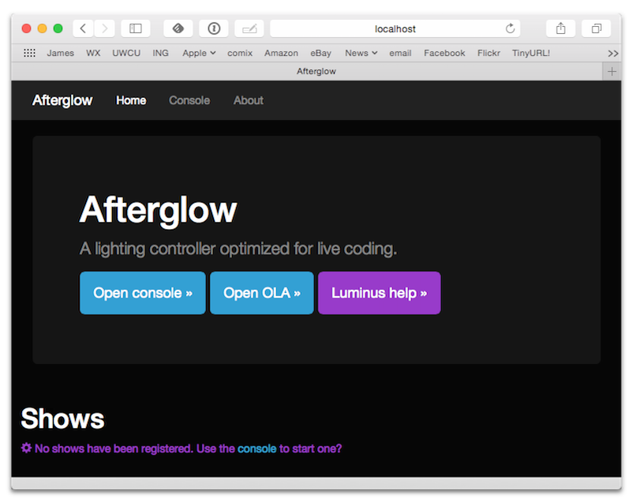
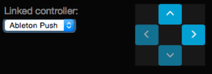
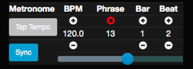

= Afterglow Documentation
James Elliott <james@deepsymmetry.org>
:icons: font
:experimental:

// Set up support for relative links on GitHub; add more conditions
// if you need to support other environments and extensions.
ifdef::env-github[:outfilesuffix: .adoc]

To keep page sizes manageable, this information is split into several
pages. This page provides an <<what-is-afterglow,introduction>> and
overview, and links to other sections as needed. If you know what you
are looking for, you can also dive right into it by jumping to the
page you want:

****

[horizontal]
 <<effects#effects,Effects>>::
The building blocks of a dynamic light show, which have a
<<effects#lifecycle,lifecyle>> worth understanding, and a few
<<effects#effect-examples,examples>> to get you started.

<<parameters#dynamic-parameters,Dynamic Parameters>>:: Provide inputs
to your effects which change over time and space, enabling much more
interesting and complex appearance and behavior.

<<cues#cues,Cues>>:: Provide a convenient way to organize and trigger
effects.

<<metronomes#metronomes,Metronomes>>:: Keep track of musical time, in
terms of beats, bars, and phrases, and can be
<<mapping_sync#midi-mapping-and-beat-sync,synced>> to DJ equipment and
software.

<<oscillators#oscillators,Oscillators>>:: Convert show timing
information into waveforms that can drive your light show.

<<fixture_definitions#fixture-definitions,Fixture Definitions>>:: Tell
Afterglow how to work with different lighting hardware.

<<show_space#show-space,Show Space>>:: Explores how to measure
locations and orientations when hanging your lights so that Afterglow
can properly calculate spatial and directional effects.

<<color#working-with-color,Working with Color>>:: Introduces tools for
expressing and manipulating color values when designing lighting
effects.

<<mapping_sync#midi-mapping-and-beat-sync,Mapping and Sync>>:: Looks
at options for using MIDI controllers to run your show, and
synchronizing its metronome with DJ equipment.

<<rendering_loop#the-rendering-loop,The Rendering Loop>>:: Explains in
detail how a frame of lighting control data is calculated and sent to
the lights in the show.

****

== What is Afterglow?

Afterglow is a lighting controller designed to support
https://en.wikipedia.org/wiki/Live_coding[live coding], written in
http://clojure.org[Clojure], intended to enable people to produce
spectacular and highly customizable light shows using modern stage and
effect lighting, and which are related in deep ways to the phrasing of
music being played. (Its http://deepsymmetry.org[creator] is a DJ and
producer of light and laser shows by avocation.) Currently, the
<<effects#effects,lighting effects>> and
<<fixture_definitions#fixture-definitions,fixture definitions>> are
written and organized through Clojure code, so you will either need to
learn Clojure or work with a Clojure programmer to create new ones,
but they are controlled through MIDI control surfaces or Open Sound
Control, so once they are set up, there is great flexibility in how
you can perform them.

Someday a user interface for building shows and fixture definitions
may be created, either within Afterglow, or as a companion project,
but that is not currently planned. For now the focus is on building
rich user interfaces for controlling shows, such as the
http://deepsymmetry.org/afterglow/doc/afterglow.controllers.ableton-push.html[Ableton
Push mapping] and web interface, while using the concise expressive
power of Clojure for writing the fixture definitions, effects, and
cues.

Afterglow communicates with the lighting hardware using the
https://www.openlighting.org/ola/[Open Lighting Architecture], so it
supports a wide variety of communication methods and interfaces.
Information about
https://github.com/brunchboy/afterglow#installation[installing OLA] is
included in the project
https://github.com/brunchboy/afterglow[README].

== How Afterglow Works

The fundamental task of Afterglow is to make light shows happen. It
does this by controlling lights, communicating with them through the
https://www.openlighting.org/ola/[Open Lighting Architecture], which
can work with several kinds of control protocols, most of which are
derived from http://en.wikipedia.org/wiki/DMX512[DMX512], or a faster
implementation of its basic ideas over Ethernet. When a show is
running, Afterglow runs a thread which periodically asks “what should
all the lights be doing now?” (resulting in a single “frame” of
control values representing that moment in time), and sends the
results of that analysis to all of the OLA universes the show is
configured to control. By default this happens thirty times each
second, but the interval is configurable within the show, and should
be decided based on the fastest refresh rate of any physical
interfaces you have hooked up to Afterglow. This is described in more
detail in the
<<rendering_loop#the-rendering-loop,Rendering Loop>> section.

TIP: In principle you could have more than one show running at a time, each
controlling a different set of OLA universes, but most people will not
need this capability.

When you just create a show and call `(show/start!)`, Afterglow will
send a bunch of zero values to the show’s universes. To make
interesting things happen you add
<<effects#effects,Effects>> to the show. The default
namespace you are put into when you launch the Afterglow project using
`lein repl` has some <<effects#effect-examples,example
effects>> that can help get a feel for this concept. To get a full
understanding of how to use (and create) effects, learn about
the <<effects#lifecycle,Effect Lifecycle>>.

The effects need to know what lights they are supposed to control,
what capabilities they have, and how they are connected (what
universe, what channels), as well as how they are arranged in space.
This is accomplished by patching
<<fixture_definitions#fixture-definitions,Fixture Definitions>> to the
show. To work with the actual lights you have available, you will need
to create fixture definitions for them, unless they happen to be ones
already available in the Afterglow project. Since there are so many
kinds of lights, with more being created every month, that seems
unlikely unless the project really takes off… and, to that end, if you
_do_ create definitions for your lights, please contribute them to the
project!

To learn how to install Afterglow and the Open Lighting Architecture,
see the project https://github.com/brunchboy/afterglow[README].

Since Afterglow was developed to create light shows for electronic
music events, it is deeply driven by the notion of musical time,
through its <<metronomes#metronomes,Metronomes>>, so
it is worth learning how to configure and interact with them. It is
also designed to work with MIDI controllers, both to trigger effects,
and to synchronize with music, as described in
<<mapping_sync#midi-mapping-and-beat-sync,MIDI Mapping and Beat Sync>>.

Of course, you are not going to want to have to type and evaluate
Clojure expressions to create your effects in the heat of the moment
of running a light show, so Afterglow shows incorporate a grid of
<<cues#cues,Cues>> that you can trigger and adjust quickly, both
through the embedded web interface described below, and with dedicated
physical grid controllers or simpler MIDI controllers.

== The Embedded Web Interface

Although a physical grid controller (especially one as well-designed
as the
http://deepsymmetry.org/afterglow/doc/afterglow.controllers.ableton-push.html[Ableton
Push]) offers the ideal control surface for running a light show, you
can do a lot with just the web interface built in to Afterglow. And
even when you have a Push or other grid controller, the web interface
makes it all the more powerful by adding at-a-glance documentation of
cue names, as well as alternate ways of doing things, or the
opportunity to interact with more than one section of the cue grid at
once.

If you have started Afterglow by running the jar file, it will have
opened a browser window on the web interface by default. Otherwise,
you can bring it up by evaluating:

[source,clojure]
----
(core/start-web-server 16000 true)
----

TIP: The `16000` specifies the port number on which the web interface
will run. You can use a different port number if you want: just pick an
unused port and type it instead. The `true` requests the browser
window; it will be opened on whatever port you told the web interface
to use.

    
The home page offers some buttons which can take you to this
documentation, the Open Lighting Architecture console in case you want
to monitor DMX values or configure the universe(s) that your show will
be using, and an embedded web REPL that can be used to evaluate
arbitrary expressions to configure and control Afterglow. The primary
interface, however, is the show page, which is reached by a link in
the Shows section. However, when you first start Afterglow on its own,
there will be no shows running. The Console can be used to change that:

image:assets/Console.png[Web console]

NOTE: As menioned in the main project
https://github.com/brunchboy/afterglow#afterglow[Readme], the web
console is there for quick hacks, and is no substitute for a rich
Clojure development environment. For any real work you will want to
either start Afterglow from your development REPL in the first place,
or to connect it via `nrepl` if you have launched Afterglow
independently, such as through a jar file. Afterglow can offer an
embedded `nrepl` server, which can be brought up via either
https://github.com/brunchboy/afterglow#usage[command-line arguments],
or by using the web console to invoke
http://deepsymmetry.org/afterglow/doc/afterglow.core.html#var-start-nrepl[core/start-nrepl].

Once you have the web interface open, and a show running, you will
spend most of your time on the show page. Here is the bottom left
corner of the cue grid that gets created for the sample show by
http://deepsymmetry.org/afterglow/doc/afterglow.examples.html#var-make-cues[afterglow.examples/make-cues]:

image:assets/ShowGrid.png[Show control]

There are a number of different things you can control from this page.
The load indicator in the middle of the navigation bar gives you a
sense of how much headroom your system has, by showing you what
fraction of the time available for rendering the last few frames of
lighting effects was used up. As you add more complex effects, the
bar will fill in and turn red, warning you if Afterglow might not be
able to keep up.

The red Stop button next to it can be used to temporarily shut down
the show, blacking out all universes that it controls. Clicking it
again restarts the show where it would have been had it not stopped.
If there is a problem communicating with the Open Lighting
Architecture daemon, the status indicator will show Error, and there
will be a Details button you can click to get more information about
the problem Afterglow is encountering.

The majority of the page is taken up by an 8&times;8 window on to the
<<cues#cues,Cue grid>> attached to the show. You can activate any cue
shown by clicking on it; running cues will light up, and darken again
when they end. To stop a running cue, click it again. Some cues will
end immediately, others will continue to run until they reach what
they feel is an appropriate stopping point. While they are in the
process of ending, the cue cell will blink. If you want the cue to end
immediately even though it would otherwise run for a while longer, you
can click the blinking cue cell and it will be killed right then.

The text labels within the cue cells are to help identify their
purpose, and are established when the cues are created. Similarly, the
colors are intended to help identify related cues.

Some cues (especially intense ones like strobes) are configured to run
only as long as they are held down. In that case, when you click on
the cue cell, a whitened version of its color is displayed as a hint
that this is happening, and as soon as you release the mouse, the cue
will end. If you want to override this behavior, you can hold down the
kbd:[Shift] key as you click on the cue cell, and it will activate as
a normal cue, staying on until you click it a second time.

Cues may be mutually exclusive by nature, and if they were created to
reflect this (by using the same keyword to register their effects with
the show), when you activate one, the other cues which use the same
keyword are dimmed. This is a hint that when you activate one of them,
it will _replace_ the others, rather than running at the
same time.

The show may have many more cues than fit on the screen at once; the
diamond of blue arrows at the bottom right allow you to page through
the larger grid. If there are more cues available in a given
direction, that arrow will be enabled, otherwise it is dimmed.
Clicking an active arrow scrolls the view one page in that direction.
In this grid, it is currently possible to scroll up and to the right.

If you have any grid controllers you can attach them to the show. An
Ableton Push would be bound as follows:

[source,clojure]
----
(require '[afterglow.controllers.ableton-push :as push])
(def controller (push/bind-to-show *show*))
----

Once this was done, you would see a link menu appear next to the
scroll diamond, as shown in the above screen image. The link menu
allows the web interface to be tied to a grid controller, so that each
is always looking at the same page of cues. Using the scroll arrows on
either the web interface, or on the controller itself if it has them
(the Push does), will cause both to scroll simultaneously. This
provides an excellent additional layer of information about the
buttons on the physical controller.

TIP: Of course, there may be times you want to break this link, for
example so you could have access to one set of cues on the physical
buttons of your controller, while simultaneously being able to control
others via the screen and mouse. To do that, simply use the link menu
to turn off the link.

The final section of the show control interface lets you view and
adjust the Metronome that the show is using to keep time with the
music that is being played. Since Afterglow's effects are generally
defined with respect to the metronome, it is important to keep it
synchronized with the music. The metronome section shows the current
speed, in Beats Per Minute, of the metronome, and the `Tap Tempo`
button label flashes yellow at each beat. It also shows you the
current phrase number, the bar within that phrase, and beat within
that bar which has been reached.

The most basic way of synchronizing the metronome is to click the `Tap
Tempo` button at each beat of the music. After a few clicks, the
metronome will be approximately synchronized to the music. You can
also adjust the BPM by dragging the slider along the bottom, or
fine-tune it with the `+` and `-` buttons around the current BPM
value.

In order to make longer chases and effects line up properly with the
music, you will also want to make sure the count is right, that the
beat number shows `1` on the down beat, and that the bar numbers are
right as well, so that the start of a phrase is reflected as bar
number `1`. You can adjust those with the `+` and `-` buttons around
the Bar and Beat numbers. A shortcut that you can use right as a
phrase begins is to click the red `x` button above the phrase number,
which resets the metronome to Phrase 1, Bar 1, Beat 1.

Trying to keep up with tempo changes during dynamic shows can be very
difficult, so you will hopefully be able to take advantage of
Afterglow's metronome synchronization features. If you can get the DJ
to feed you <<mapping_sync#syncing-to-midi-clock,MIDI clock pulses>>
or connect via an Ethernet network to Pioneer professional DJ gear so
you can lock into the beat grid established by
<<mapping_sync#syncing-to-pro-dj-link,Pro DJ Link>>, Afterglow can
keep the BPM (with MIDI) and even the beats (with Pro DJ Link)
synchronized for you. To configure that synchronization, click the
`Sync` button once you have the clock or DJ link signals reaching the
machine running Afterglow, and choose the sync source you want to use.
