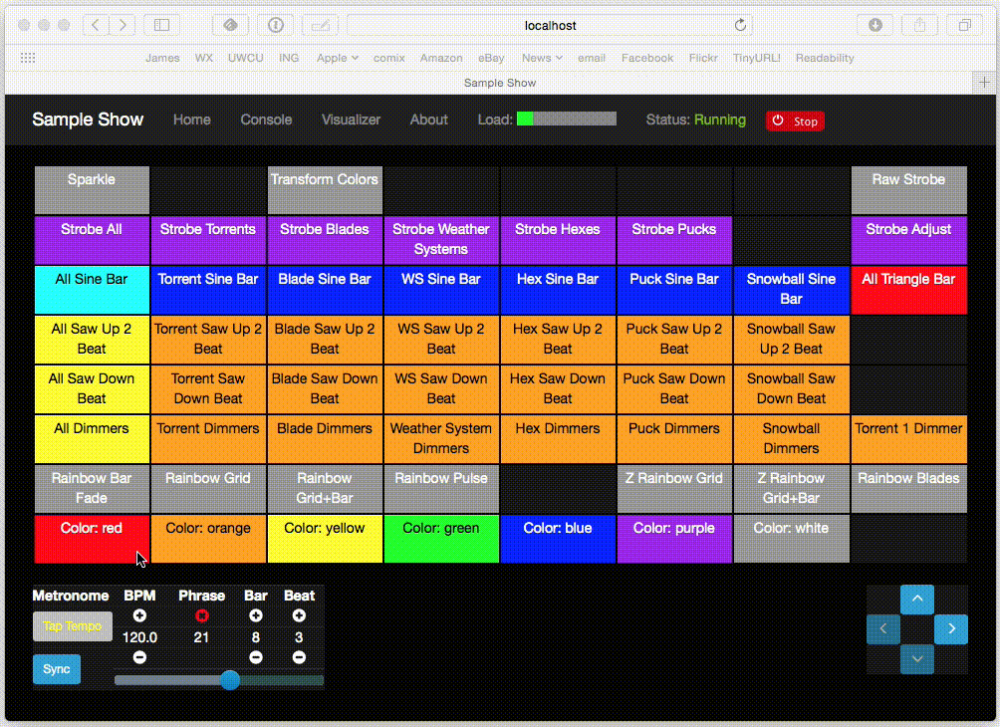
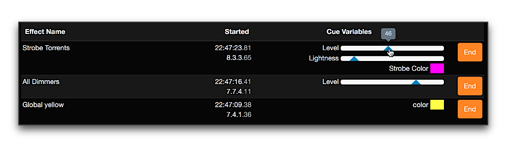
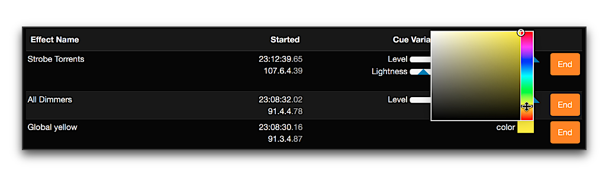
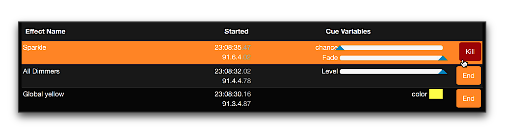
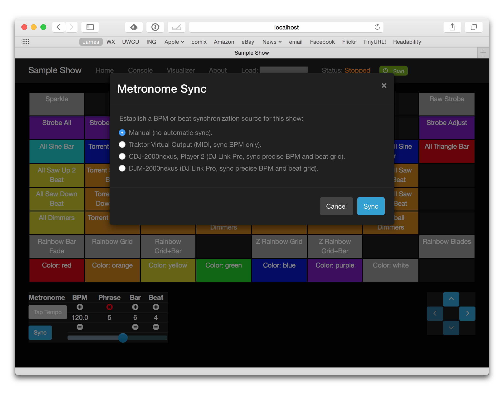
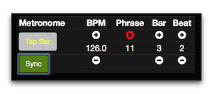

= Afterglow Documentation
James Elliott <james@deepsymmetry.org>
:icons: font
:experimental:
:api-doc: http://rawgit.com/brunchboy/afterglow/master/api-doc/

// Set up support for relative links on GitHub; add more conditions
// if you need to support other environments and extensions.
ifdef::env-github[:outfilesuffix: .adoc]

To keep page sizes manageable, this information is split into several
pages. This page provides an <<introduction,introduction>> and
<<overview,overview>>, explains the <<the-embedded-web-interface,built
in web interface>>, and links to other sections as needed. It is worth
reading through this whole page once if you are new to Afterglow,
because the orientation it provides will be helpful, and it ends with
a <<getting-started,guide>> to help you get started on your way to
creating your own light show. Once you know what you are looking for,
you can also dive right into it by jumping to the page you want:

****

[horizontal]
 <<effects#effects,Effects>>::
The building blocks of a dynamic light show, which have a
<<effects#the-effect-lifecycle,lifecyle>> worth understanding, and a few
<<effects#effect-examples,examples>> to get you started.

<<parameters#dynamic-parameters,Dynamic Parameters>>:: Provide inputs
to your effects which change over time and space, enabling much more
interesting and complex appearance and behavior.

<<cues#cues,Cues>>:: Provide a convenient way to organize and trigger
effects. Allow you to build a user interface for your show, through a
colorful cue grid in the web UI, on a supported grid controller, a
basic MIDI controller, or a combination of several of these options.

<<metronomes#metronomes,Metronomes>>:: Keep track of musical time, in
terms of beats, bars, and phrases, and can be
<<mapping_sync#midi-mapping-and-beat-sync,synced>> to DJ equipment and
software.

<<oscillators#oscillators,Oscillators>>:: Convert show timing
information into waveforms that can drive your light show.

<<fixture_definitions#fixture-definitions,Fixture Definitions>>:: Tell
Afterglow how to work with different lighting hardware.

<<show_space#show-space,Show Space>>:: Explores how to measure
locations and orientations when hanging your lights so that Afterglow
can properly calculate spatial and directional effects.

<<color#working-with-color,Working with Color>>:: Introduces tools for
expressing and manipulating color values when designing lighting
effects.

<<mapping_sync#midi-mapping-and-beat-sync,Mapping and Sync>>:: Looks
at options for using MIDI controllers to run your show, and
synchronizing its metronome with DJ equipment.

<<rendering_loop#the-rendering-loop,The Rendering Loop>>:: Explains in
detail how a frame of lighting control data is calculated and sent to
the lights in the show. This is advanced, low-level information for
people who are ready to create their own custom effect algorithms.

{api-doc}index.html[API Documentation]:: Generated from Afterglow's
Clojure source code, to provide information about all the namespaces
and functions that make it work. The rest of the documentation
sometimes links to related sections of the API documentation, and vice
versa.

<<videos#videos,Videos>>:: Show examples of Afterglow in action.

****

image:assets/Afterglow-logo.png[Afterglow logo,128,127,align="center"]

[[introduction]]
== What is Afterglow?

Afterglow is a lighting controller designed to support
https://en.wikipedia.org/wiki/Live_coding[live coding], written in
http://clojure.org[Clojure], intended to enable people to produce
spectacular and highly customizable light shows using modern stage and
effect lighting, and which are related in deep ways to the phrasing of
music being played. (Its http://deepsymmetry.org[creator] is a DJ and
producer of light and laser shows by avocation.) Currently, the
<<effects#effects,lighting effects>> and
<<fixture_definitions#fixture-definitions,fixture definitions>> are
written and organized through Clojure code, so you will either need to
learn Clojure or work with a Clojure programmer to create new ones,
but they are controlled through MIDI control surfaces or Open Sound
Control, so once they are set up, there is great flexibility in how
you can perform them.

Someday a user interface for building shows and fixture definitions
may be created, either within Afterglow, or as a companion project,
but that is not currently planned. For now the focus is on building
rich user interfaces for controlling shows, such as the
<<mapping_sync#using-ableton-push,Ableton Push>> and
<<mapping_sync#using-launchpad-pro,Novation Launchpad family>>
mappings and the <<README#the-embedded-web-interface,embedded web
interface>>, while using the concise expressive power of Clojure for
writing the fixture definitions, effects, and cues.

Afterglow communicates with the lighting hardware using the
https://www.openlighting.org/ola/[Open Lighting Architecture], so it
supports a wide variety of communication methods and interfaces.
Information about
https://github.com/brunchboy/afterglow#installation[installing OLA] is
included in the project
https://github.com/brunchboy/afterglow[README].

[[overview]]
== How Afterglow Works

The fundamental task of Afterglow is to make light shows happen. It
does this by controlling lights, communicating with them through the
https://www.openlighting.org/ola/[Open Lighting Architecture], which
can work with several kinds of control protocols, most of which are
derived from http://en.wikipedia.org/wiki/DMX512[DMX512], or a faster
implementation of its basic ideas over Ethernet. When a show is
running, Afterglow runs a thread which periodically asks “what should
all the lights be doing now?” (resulting in a single “frame” of
control values representing that moment in time), and sends the
results of that analysis to all of the OLA universes the show is
configured to control. By default this happens 40 times each
second, but the interval is configurable within the show, and should
be decided based on the fastest refresh rate of any physical
interfaces you have hooked up to Afterglow. This is described in more
detail in the
<<rendering_loop#the-rendering-loop,Rendering Loop>> section.

TIP: In principle you could have more than one show running at a time, each
controlling a different set of OLA universes, but most people will not
need this capability.

When you just create a show and call `(show/start!)`, Afterglow will
send a bunch of zero values to the show’s universes. To make
interesting things happen you add
<<effects#effects,Effects>> to the show. The default
namespace you are put into when you launch the Afterglow project using
`lein repl` has some <<effects#effect-examples,example
effects>> that can help get a feel for this concept. To get a full
understanding of how to use (and create) effects, learn about
the <<effects#the-effect-lifecycle,Effect Lifecycle>>.

The effects need to know what lights they are supposed to control,
what capabilities they have, and how they are connected (what
universe, what channels), as well as how they are arranged in space.
This is accomplished by patching
<<fixture_definitions#fixture-definitions,Fixture Definitions>> to the
show. To work with the actual lights you have available, you will need
to create fixture definitions for them, unless they happen to be ones
already available in the Afterglow project. Since there are so many
kinds of lights, with more being created every month, that seems
unlikely unless the project really takes off… and, to that end, if you
_do_ create definitions for your lights, please contribute them to the
project!

To learn how to install Afterglow and the Open Lighting Architecture,
see the project https://github.com/brunchboy/afterglow[README].

Since Afterglow was developed to create light shows for electronic
music events, it is deeply driven by the notion of musical time,
through its <<metronomes#metronomes,Metronomes>>, so
it is worth learning how to configure and interact with them. It is
also designed to work with MIDI controllers, both to trigger effects,
and to synchronize with music, as described in
<<mapping_sync#midi-mapping-and-beat-sync,MIDI Mapping and Beat Sync>>.

Of course, you are not going to want to have to type and evaluate
Clojure expressions to create your effects in the heat of the moment
of running a light show, so Afterglow shows incorporate a grid of
<<cues#cues,Cues>> that you can trigger and adjust quickly, both
through the embedded web interface described below, and with dedicated
physical grid controllers or simpler MIDI controllers.

== The Embedded Web Interface

Although a physical grid controller (especially one as well-designed
as the <<mapping_sync#using-ableton-push,Ableton Push>> or
<<mapping_sync#using-launchpad-pro,Novation Launchpad Pro>>) offers
the ideal control surface for running a light show, you can do a lot
with just the web interface built in to Afterglow. And even when you
have a Push or other grid controller, the web interface makes it all
the more powerful by adding at-a-glance documentation of cue names, as
well as alternate ways of doing things, or the opportunity to interact
with more than one section of the cue grid at once.

If you have started Afterglow by running the jar file, it will have
opened a browser window on the web interface by default. Otherwise,
you can bring it up by evaluating:

[source,clojure]
----
(core/start-web-server 16000 true)
----

TIP: The `16000` specifies the port number on which the web interface
will run. You can use a different port number if you want: just pick an
unused port and type it instead. The `true` requests the browser
window; it will be opened on whatever port you told the web interface
to use.

image:assets/WebHome.png[Web interface]
    
The home page offers some buttons which can take you to this
documentation, the Open Lighting Architecture console in case you want
to monitor DMX values or configure the universe(s) that your show will
be using, and an embedded web REPL that can be used to evaluate
arbitrary expressions to configure and control Afterglow. The primary
interface, however, is the show page, which is reached by a link in
the Shows section. However, when you first start Afterglow on its own,
there will be no shows running. The Console can be used to change that:

image:assets/Console.png[Web console]

NOTE: As menioned in the main project
https://github.com/brunchboy/afterglow#afterglow[Readme], the web
console is there for quick hacks, and is no substitute for a rich
Clojure development environment. For any real work you will want to
either start Afterglow from your development REPL in the first place,
or to connect it via `nrepl` if you have launched Afterglow
independently, such as through a jar file. Afterglow can offer an
embedded `nrepl` server, which can be brought up via either
https://github.com/brunchboy/afterglow#usage[command-line arguments],
or by using the web console to invoke
{api-doc}afterglow.core.html#var-start-nrepl[`core/start-nrepl`].

=== Show Control

Once you have the web interface open, and a show running, you will
spend most of your time on the show page. Here a look at the cue grid
that gets created for the sample show by
{api-doc}afterglow.examples.html#var-make-cues[`afterglow.examples/make-cues`]:

There are a number of different things you can control from this page.
The load indicator in the middle of the navigation bar gives you a
sense of how much headroom your system has, by showing you what
fraction of the time available for rendering the last few frames of
lighting effects was used up. As you add more complex effects, the
bar will fill in and turn red, warning you if Afterglow might not be
able to keep up.

The red `Stop` button next to it can be used to temporarily shut down
the show, blacking out all universes that it controls. Clicking it
again restarts the show where it would have been had it not stopped.
If there is a problem communicating with the Open Lighting
Architecture daemon, the status indicator will show Error, and there
will be a `Details` button you can click to get more information about
the problem Afterglow is encountering.

==== Cues

The majority of the page is taken up by an 8&times;8 window on to the
<<cues#cues,Cue grid>> attached to the show. You can activate any cue
shown by clicking on it; running cues will light up, and darken again
when they end. To stop a running cue, click it again. Some cues will
end immediately, others will continue to run until they reach what
they feel is an appropriate stopping point. While they are in the
process of ending, the cue cell will blink. If you want the cue to end
immediately even though it would otherwise run for a while longer, you
can click the blinking cue cell and it will be killed right then.

The text labels within the cue cells are to help identify their
purpose, and are established when the cues are created. Similarly, the
colors are intended to help identify related cues.

Some cues (especially intense ones like strobes) are configured to run
only as long as they are held down. In that case, when you click on
the cue cell, a whitened version of its color is displayed as a hint
that this is happening, and as soon as you release the mouse, the cue
will end. If you want to override this behavior, you can hold down the
kbd:[Shift] key as you click on the cue cell, and it will activate as
a normal cue, staying on until you click it a second time.

Cues may be mutually exclusive by nature, and if they were created to
reflect this (by using the same keyword to register their effects with
the show, or specifying other effect keys in their `:end-keys` list),
when you activate one, the other cues which use the same keyword are
darkened. This is a hint that when you activate one of them, it will
_replace_ the others, rather than running at the same time. The
<<cues#the-cue-grid,Cue Grid section>> of the Cues documentation goes
into more details about the relationships between cues illustrated in
the above animation.

==== Effect Control

When any effects are running, whether they were launched by a cue
button or some other means, they are listed at the bottom of the show
control page, in descending order of priority. (Effects are run in the
reverse order that they appear on the screen, so effects towards the
top of the list can override things done by those further down. Newly
launched effects assigned a given priority appear above older ones
with the same priority.)

The name of the effect is shown, along with when it was started, in
terms of clock time (down to 1/100 of a second), and the show
Metronome (phrase, bar, beat, and hundredths of a beat).

If an effect was launched by a cue with any cue variables, they appear
after the start time. Numeric cue variables can be adjusted by
dragging the associated slider. As shown in the image above, the
current value appears as a popup above the slider thumb when the mouse
is over the slider. Color cue variables can also be adjusted. The
current color value appears as a swatch; clicking on that swatch opens
a color picker interface which can be used to adjust the color
parameter:

Click anywhere outside the swatch and color picker to dismiss the
color adjustment interface.

If cue variables are adjusted somewhere else, such as a mapped MIDI
controller or from other code that is running, the web interface will
update to show their changed values.

A running effect can be asked to end by clicking its kbd:[End] button.
If the effect takes a while to end, its entire row will take on the
color of the kbd:[End] button while it is in the process of ending,
and the button becomes a kbd:[Kill] button which can be clicked to
instantly terminate the ending effect:

==== Scrolling and Linked Controllers

The show may have many more cues than fit on the screen at once; the
diamond of blue arrows below the bottom right of the cue grid allow
you to page through the larger grid. If there are more cues available
in a given direction, that arrow will be enabled, otherwise it is
dimmed. Clicking an active arrow scrolls the view one page in that
direction. In this grid, it is currently possible to scroll up and to
the right.

image:assets/CueScrollLink.png[Cue scroll arrows and link menu,align="right"]

If you have any grid controllers you can attach them to the show. An
Ableton Push would be bound as follows, assuming its User Port shows
up in your MIDI environment with the standard name `"User Port"`:

[source,clojure]
----
(require '[afterglow.controllers :as ct])
(def watcher (ct/auto-bind *show* "User Port"))
----

Once this was done, whenever a Push was connected and powered on, you
would see a link menu appear next to the scroll diamond, as shown in
the above screen image. The link menu allows the web interface to be
tied to a grid controller, so that each is always looking at the same
page of cues. Using the scroll arrows on either the web interface, or
on the controller itself if it has them (the Push does), will cause
both to scroll simultaneously. This provides an excellent additional
layer of information about the buttons on the physical controller.

TIP: Of course, there may be times you want to break this link, for
example so you could have access to one set of cues on the physical
buttons of your controller, while simultaneously being able to control
others via the screen and mouse. To do that, simply use the link menu
to turn off the link.

==== Brightness Control

In the center of the interface below the cue grid is a slider that
lets you adjust the show's dimmer grand master. This can be used to
control the overall brightness of the show, because any dimmer cues
that are running will be affected by the value of this master. If it
is set at 100% (all the way to the right), the dimmer cues can operate
at full brightness. As you slide it to the left, it gradually reduces
the maximum brightness that any dimmer cue can achieve. In the middle,
all dimmer cues will be reduced by 50%, and all the way to the left,
all dimmer cues will be zeroed out.

image:assets/GrandMaster.png[Dimmer Grand Master]

==== Metronome Control

The final section of the show control interface, left of the Dimmer
Grand Master section, lets you view and adjust the Metronome that the
show is using to keep time with the music that is being played. Since
Afterglow's effects are generally defined with respect to the
metronome, it is important to keep it synchronized with the music. The
metronome section shows the current speed, in Beats Per Minute, of the
metronome, and the `Tap Tempo` button label flashes yellow at each
beat. It also shows you the current phrase number, the bar within that
phrase, and beat within that bar which has been reached.

image:assets/Metronome.png[Metronome]

The most basic way of synchronizing the metronome is to click the `Tap
Tempo` button at each beat of the music. Tapping the button aligns the
metronome to a beat, and if you tap it three or more times within two
seconds of each preceding tap, sets the metronome's BPM. Tap it as you
hear each beat of the music, and after three or more taps, the speed
of the metronome will be approximately synchronized with the music.
You can also adjust the BPM by dragging the slider along the bottom,
or fine-tune it with the `+` and `-` buttons around the current BPM
value.

Once the tempo is correct, you can tell Afterglow which beat is the
down beat by holding down kbd:[Shift] while pressing kbd:[Tap Tempo].
(The label of the button will change to kbd:[Tap Bar] while
kbd:[Shift] is down). This combination does not change the tempo, but
tells Afterglow that the moment when you tapped the button is the down
beat (the first beat of a bar).

In order to make longer chases and effects line up properly with the
music, you will also want to make sure the count is right, that the
beat number shows `1` on the down beat, and that the bar numbers are
right as well, so that the start of a phrase is reflected as bar
number `1`. In addition to using kbd:[Shift] with kbd:[Tap Tempo] to
set the down beat, you can adjust the count using the `+` and `-`
buttons around the Bar and Beat numbers.

A shortcut that you can use right as a phrase begins is to click the
red `x` button above the phrase number, which resets the metronome to
Phrase 1, Bar 1, Beat 1.

Trying to keep up with tempo changes during dynamic shows can be
tedious, so you will hopefully be able to take advantage of
Afterglow's metronome synchronization features. If you can get the DJ
to feed you <<mapping_sync#syncing-to-midi-clock,MIDI clock pulses>>
or <<mapping_sync#syncing-to-traktor-beat-phase,Traktor Beat Phase>>,
or connect via a Local Area Network to Pioneer professional DJ gear to
lock into the beat grid established by
<<mapping_sync#syncing-to-pro-dj-link,Pro DJ Link>>, Afterglow can
keep the BPM (with MIDI) and even the beats (with Traktor Beat Phase
or Pro DJ Link) synchronized for you. To configure that
synchronization, click the `Sync` button once you have the MIDI clock,
beat phase, or network Pro DJ Link signals reaching the machine
running Afterglow, and choose the sync source you want to use.

TIP: When you are synchronizing with Pro DJ Link, you will almost
always want to sync to the mixer, rather than one of the CDJs, so you
stay in sync as the DJs mix between tracks.

The actual list of choices you will see depends on what MIDI and DJ
Link Pro traffic Afterglow has seen in the last few seconds, and will
update as players and mixers start and stop sending clock or beat grid
information.

NOTE: Limitations in the standard Java MIDI drivers on the Mac
currently require any MIDI devices, whether real or virtual, to be
connected when Afterglow first starts in order for them to be visible.
So if you are on a Mac, you will very much want to install
https://github.com/DerekCook/CoreMidi4J/releases[CoreMIDI4J] as
discussed on the
https://github.com/brunchboy/afterglow/wiki/Questions#midi-from-java-on-the-mac[Afterglow
Wiki].

Once your sync is established, the `Tap Tempo` button changes. If you
are using MIDI clock to sync the BPM, it becomes a `Tap Beat` button,
which simply establishes where the beat falls. If you are locked in to
a Pro DJ Link or Traktor Beat Phase beat grid, it becomes a `Tap Bar`
button which, when pressed, indicates that the current beat is the
down beat (start) of a bar. Similarly, if you press the metronome
Reset button (the red x above the phrase counter) while synced to a
Pro DJ Link or Traktor Beat Phase beat grid, the beat itself will not
move, but the beat closest to when you pressed the pad will be
identified as Beat 1. In these sync modes you can also use the
kbd:[Shift] key to align at the next bigger boundary: If tapping
would normally move the bar, shift-tapping will move the phrase.

The Sync button also turns green to indicate that sync is in effect.
If something interrupts the sync process (such as the network link
being broken, or the DJ software's MIDI clock generator being turned
off), the button will turn red to warn you that it is not working.
Pressing the Sync button again will give you more information to
troubleshoot the problem.

== Getting Started

There is a lot to Afterglow, and already a lot of documentation. In an
effort to help you find your way through it, here is a guide to the
steps you'll want to take to get a basic light show up and running.
Once you are there, you can branch off and explore extending it in any
direction you like, and hopefully contribute back the fixture
definitions and new effects and cues you come up with!

. If you don't know any Clojure, you are going to want to learn at
least a little. Luckily, it is a fantastic, helpful community, and an
amazing language (the existence of Afterglow after a couple of months
of spare time work is good proof of that)! The
http://clojure.org/getting_started[Getting Started] page on
clojure.org has links to some great resources. Don't miss
http://www.braveclojure.com[Clojure for the Brave and True], a fun
book under development which can be read in its entirety online.

. Install Afterglow. For now the best way to do that is following the
steps in the
https://github.com/brunchboy/afterglow#installation[Installation]
section on the main project page, to install the Open Lighting
Architecture, then create a new Clojure project with Leiningen that
includes Afterglow as a dependency.

. Set up your universe(s) in OLA. Their own
https://www.openlighting.org/ola/getting-started/[Getting Started]
page may be helpful. Until OLA is successfully communicating with your
lights, whether over a USB DMX interface, Artnet over a LAN, or the
like, Afterglow will not be able to control them. Even though their
examples show using the command-line tools to configure your
interface, today you will likely find the web interface, especially
the beta new UI, much more convenient and easy to learn. With a
default installation, once you have `olad` running, you can find that
at http://localhost:9090/new/[http://localhost:9090/new/].

. Find or create <<fixture_definitions#fixture-definitions,fixture
definitions>>. Once you are able to get your lights to do things by
manipulating the Faders section of the OLA web interface, it is time
to get Afterglow ready to talk to them. There are a vast number of
fixture types out there, and at this early stage almost none of them
are built in to Afterglow, so you will probably need to create your
own. The <<fixture_definitions#fixture-definitions,documentation>>
explains how, and links to existing fixture definitions as examples.
You can also ask for help on the
https://gitter.im/brunchboy/afterglow[Gitter chat] or the
https://github.com/brunchboy/afterglow/wiki/Questions[Wiki].
+
At this point you are almost certainly writing enough code that you
want to save it for later reuse. The
https://github.com/brunchboy/afterglow#usage[Usage] section of the
project page explains how you can have Afterglow load files when it
starts up when you are running it as a standalone jar, which makes it
easier to use your own configuration files.
+
. Patch your actual fixture channels and locations. Once you have
working definitions for your fixtures, you will want to create a show
that tells Afterglow what fixtures you have, and the DMX universes and
channels you have them connected to, and how you have them arranged in
physical space. You will want to create a namespace for your show
along the lines of
{api-doc}afterglow.examples.html[`afterglow.examples`],
and a function like
{api-doc}afterglow.examples.html#var-use-sample-show[`use-sample-show`]
which sets up your own show.

. Create the cues you want. Much as the
{api-doc}afterglow.examples.html#var-make-cues[`make-cues`]
function in the examples namespace creates a bunch of cues that work
with the sample show's fixtures, you will want cues that create
effects to make your lights do interesting things, and which are
arranged, labeled, and colored in a way that makes sense to you.

. Map some cues to a controller, if you have one. If you have an
Ableton Push, you are in luck because you will be able to take
advantage of the built in <<mapping_sync#using-ableton-push,support>>
Afterglow offers. Or perhaps a
<<mapping_sync#using-launchpad-pro,Novation Launchpad>>? But even
if you just have a simple MIDI controller with a few buttons and
faders, or even a keyboard, you can
<<mapping_sync#midi-mapping-and-beat-sync,map>> keys, buttons, and
faders to trigger cues and adjust variables used by the cues.

. Run the show! With or without a physical controller, you can create
your show by calling the function you wrote modeled on
`use-sample-show`, then bring up the
<<README#the-embedded-web-interface,embedded web interface>> to
trigger your cues and watch the results.

. Create your own custom effects if you want to be fancy. Once you
feel constrained by the limits of the <<effects#effects,effects>> that
are built in to the current release of Afterglow, the whole point of
the environment it offers is to enable people to imagine and create
brand new effects. You have the full power of the language used to
create Afterglow at your fingertips at every moment to create and
explore new ideas; you are not constrained to the limited scripting
environment that most lighting control software offers, if it offers
any at all.

. Don't forget to contribute your fixture definitions and effects to
the Afterglow community! If you are confident that you have fully
mapped out the functions of a fixture, please make a pull request to
include it in afterglow, either within the existing namespace for its
manufacturer, or creating a new namespace for a new manufacturer.
Similarly, if you have created an awesome new kind of effect, please
consider a pull request to add it somewhere within the effects
namespace hierarchy. And if you are just tinkering with something new
and experimental, please post about it on the
https://gitter.im/brunchboy/afterglow[Gitter chat]!

## License

++++++
Copyright © 2015-2016 http://deepsymmetry.org[Deep Symmetry, LLC]

Distributed under the
http://opensource.org/licenses/eclipse-1.0.php[Eclipse Public License
1.0], the same as Clojure. By using this software in any fashion, you
are agreeing to be bound by the terms of this license. You must not
remove this notice, or any other, from this software. A copy of the
license can be found in
https://rawgit.com/brunchboy/afterglow/master/resources/public/epl-v10.html[resources/public/epl-v10.html]
within this project.
