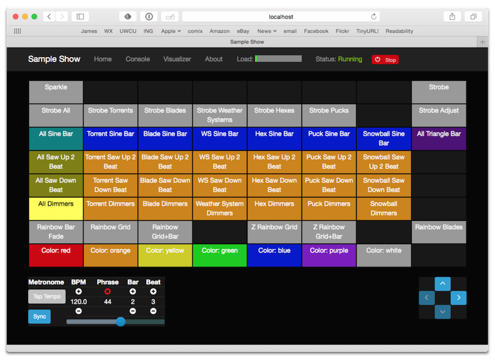

= Cues
James Elliott <james@deepsymmetry.org>
:icons: font
:toc:
:toc-placement: preamble

// Set up support for relative links on GitHub; add more conditions
// if you need to support other environments and extensions.
ifdef::env-github[:outfilesuffix: .adoc]

Cues are designed to support creating user interfaces for controlling
effects. They provide a convenient way to organize, identify, trigger,
adjust, and monitor effects. Each
http://deepsymmetry.org/afterglow/doc/afterglow.show.html[show] in
Afterglow maintains a cue grid, which can be viewed and interacted
with through the <<README#the-embedded-web-interface,embedded web
interface>> and MIDI controller mapping implementations which can be
http://deepsymmetry.org/afterglow/doc/afterglow.show.html#var-register-grid-controller[registered
as grid controllers], like the <<mapping_sync#using-ableton-push,Ableton Push>>.

== The Cue Grid

The cue grid is a two dimensional arrangement of cues, where the
bottom left corner is assigned coordinates `(0, 0)`. X coordinates
increase from left to right, and Y coordinates increase from bottom to
top. The web interface and registered grid controllers display 64 cues
at a time in an 8&times;8 grid, and can be scrolled around that grid.
The user can configue (&ldquo;link&rdquo;) the web interface to track
the scroll position of a registered grid controller. When that is
done, scrolling either interface will cause the other to scroll in the
same way, so the browser window can act as documentation to help the
user learn the cue names associated with each available cue pad on the
controller.



In addition to names, cues can be assigned colors in the grid, and the
web interface will honor those colors, as will the physical grid
controllers, within the limits of their capabilities. To provide
feedback about cue activation, a lightened version of the cue color is
displayed for cues which are currently active. And to help inform the
user about cue compatibility, any cues which are assigned the same
effect keyword, meaning they will terminate each other when launched,
will be displayed in a darkened color if an effect with that keyword
is currently running. Examples of both of these can be seen in the
first column of cues above, in which the &ldquo;All Dimmers&rdquo; cue
is active and displaying a lightened version of the yellow color
assigned to it, and the two cues above it, &ldquo;All Saw Down
Beat&rdquo; and &ldquo;All Saw Up 2 Beat&rdquo; use the same keyword
and color, and so are displaying a darkened version of the yellow
color. This is a useful technique for building easy-to-learn cue
grids. The same cues are shown on the Ableton Push below, so you can
see how the color relationships help with learning the cue names.

image::assets/AbletonInterface.jpg[Ableton Push interface]

To trigger a cue, simply press the corresponding pad on a physical
interface, or click within the grid cell in the web interface. The
effect associated with the cue will be created and added to the show,
and the grid cell will be lightened to indicate that the cue's
effect is running. If the cue ends itself after a period, the grid
interface will be updated to reflect that as well.

To end a cue's effect before it would naturally end (or because
it is open-ended and does not end until asked to), simply press the
pad corresponding to the running cue (or, again, click the grid cell
in the web interface). The effect will be asked to end. Some effects
end instantly, which will be refleced by the cue grid cell returning
to its normal color. Some effects have a delayed ending, so they can
fade out, or finish some musically relevant sequence. If this is
happening, the grid cell will blink while the effect ends, and then
stay at its normal color once the effect finishes ending. If you want
the effect to end immediately you can press the pad one more time
while the effect is performing its gradual ending, and it will be
killed at that point, regardless of how much longer it was planning to
run.

[[held-flag]]Cues can also be created which run only as long as the
corresponding controller pad is held down (this is done by passing a
true value with the `:held` optional keyword argument when creating
the cue). This is often done for intense effects like strobes.

Cues can also offer pressure sensitivity on controllers which support
this (like the Ableton Push). For such cues, one or more variable used
by the cue can be updated by the strike and aftertouch pressure
exerted by the operator as they hold down the pad. This can make for
very expressive effects, as exemplified by the Sparkle cue set up
early in the examples namespace's
http://deepsymmetry.org/afterglow/doc/afterglow.examples.html#var-make-cues[make-cues]
function, and its
http://deepsymmetry.org/afterglow/doc/afterglow.examples.html#var-make-strobe-cue[strobe]
cues. Of course, this pressure sensitivity is not possible with the
web cue grid.

The interface for moving around the cue grid is the diamond of arrows
at the bottom right of both the web interface and the Ableton Push. If
there are more cues available in a particular direction, that arrow is
lit, otherwise it is dark. For the cues pictured above, the bottom
left corner of the cue grid is being displayed, and there are more
cues above and to the right, so the up and right scroll arrows are
lit. Pressing an arrow scrolls to the next set of eight rows or
columns in that direction. (And if the web view is linked to a grid
controller, pressing the arrow on either will scroll both. For
physical grid controllers which lack scroll buttons, linking them to
the web interface is the most practical way of scrolling them.)

Cues can also be triggered from simpler MIDI controllers (which
don't register as grid controllers) by explicitly mapping notes
or control changes sent by the controller to cues within the grid
using
http://deepsymmetry.org/afterglow/doc/afterglow.show.html#var-add-midi-control-to-cue-mapping[afterglow.show/add-midi-control-to-cue-mapping].
Regardless of the mechanism by which a cue is triggered, the web
interface, a registered grid controller, or an explicitly mapped MIDI
note or control change, feedback will be sent to all interfaces so the
status of the cue will be represented consistently on all of them. And
a cue triggered on one controller can be ended on any other controller
by simply pressing the lit button or clicking the lit cell there.

For example, to be able to trigger the Sparkle cue, which the examples
namespace places at `(0, 7)` within the sample show cue grid, by
pressing the bottom leftmost button on my inexpensive Korg nanoKontrol
2 MIDI controller, after using
http://deepsymmetry.org/afterglow/doc/afterglow.midi.html#var-identify-mapping[afterglow.midi/identify-mapping]
to determine that the button sends control-change messages for
controller number `43`, I can simply evaluate:

[source,clojure]
----
(show/add-midi-control-to-cue-mapping "nano" 0 :control 43 0 7)
----

Now I can press the top-left pad on the Push, click the top left cell
in the Web interface, or press that button on the nanoKontrol, and the
Sparkle cue lights up on all three interfaces, and the effect runs and
sparkles the lights.

[NOTE]
====

In order to enable Afterglow to send feedback about cue status to the
lights on the nanoKontrol I needed to use the Korg Kontrol Editor to
set its LED Mode to _External_ (as shipped, they were in _Internal_
mode, and lit themselves when held down). Most MIDI controllers are
likely to need similar configuration to work as feedback-capable cue
controllers with Afterglow, but most I have seen do offer
configuration tools to enable this kind of external control.

====

[[creating-cues]]
== Creating Cues

The
http://deepsymmetry.org/afterglow/doc/afterglow.effects.cues.html[afterglow.effects.cues]
namespace provides functions for creating cues. Unsurprisingly, the
http://deepsymmetry.org/afterglow/doc/afterglow.effects.cues.html#var-cue[cue]
function creates a cue. At its most basic, you pass in two parameters,
`show-key` which is the keyword that will be used to add the cue's
effect to the show when the cue is triggered, ending any other effect
running under that same keyword, and `effect-fn`, which is a function
that will be called when the cue is triggered, and whose
responsibility is to create and return the effect that the cue should
add to the show. This is done so that a fresh instance of the effect
is used each time the cue is triggered, in case the effect is complex
and maintains its own state. `effect-fn` will be passed a map
containing any <<cues#cue-variables,cue-specific variable bindings>>.

NOTE: For the very common case of wanting to create a cue to activate
a fixture-specific _function_ (capability), and perhaps adjust the
function's activation level while it runs, you can instead call the
special-purpose `function-cue` described
<<cues#creating-function-cues,below>>.

There are a number of optional keyword parameters which can be used to
modify the cue that is created. Remember that you can also consult the
http://deepsymmetry.org/afterglow/doc/afterglow.effects.cues.html#var-cue[API
documentation] for another explanation of these functions, and for
links to examine the source code, which is the most authoritative
explanation of how they work, and can offer inspiration for variations
that you might want to create yourself.

[cols="1a,1a,5a", options="header"]
.Keyword parameters to `cue`
|===
|Parameter
|Default
|Purpose

|`:short-name`
|effect name

|Sets the text to be displayed for the cue in the web cue grid, and in
the text display of the controller (if it has one) when the cue is
running. If you don't supply a short name, the name of the
effect created by the `effect-fn` function is used, but that may be too
long or not informative enough.

|`:color`
|white

|Sets the color of the cue within the grid for hinting about its
purpose and relatedness to other cues, to help operators learn and
understand the interface. If not specified, white is used.

|`:end-keys`
|none

|A list of keywords that identify additional effects to be ended when
launching this cue. See the dimmer cue section of
http://deepsymmetry.org/afterglow/doc/afterglow.examples.html#var-make-cues[make-cues]
for an example of how this can be helpful: it sets up a couple of rows
of dimmer cues where the leftmost affects all the dimmers in the
lighting rig, and cancels all the cues that work on individual light
groups, while the individual light group dimmer cues cancel the
all-dimmers cues, but leave the dimmer cues for other light groups
alone.

|`:priority`
|`0`

|Sets the effect priority used when adding the cue's effect to the
show. This can be used to make sure the effect runs before or after
other effects in the <<rendering_loop#the-rendering-loop,rendering
loop>>. Effects are run in order, and later effects can modify or
override the results of earlier ones, like the way the Sparkle effect
in
http://deepsymmetry.org/afterglow/doc/afterglow.examples.html#var-make-cues[make-cues]
is assigned a priority of 100 so it sorts after any chase which may be
running, and its sparkles can lighten the color which would otherwise
be present in their fixtures.

|`:held`
|`false`

|As described <<cues#held-flag,above>>, causes the cue's effect to run
only as long as the corresponding controller button or pad is held
down, if the controller supports that capability. All current
controller implementations, including the web interface, the
<<mapping_sync#using-ableton-push,Ableton Push mapping>>, and mappings
to generic MIDI controllers created using
http://deepsymmetry.org/afterglow/doc/afterglow.show.html#var-add-midi-control-to-cue-mapping[afterglow.show/add-midi-control-to-cue-mapping],
do honor this setting. The web interface and controllers like the
Push, which can vary the color of cue grid cells, will provide
feedback that a cue will last only as long as it is held by displaying
a whitened version of the cue color while it is held down.

Show operators can override the `:held` flag by holding down the
`Shift` key when triggering the cue on interfaces which have `Shift`
keys (like the web interface and Ableton Push). This will cause the
cue to run until the corresponding pad or grid cell is pressed again,
and will not whiten the cue color while it is held down.

|`:variables`
|none

|Specifies a sequence of show variable bindings that
can be used by the cue's effect. Each variable specification is a map,
whose content is described in the following table. These
specifications are used to create any necessary new variables, and a
map describing any cue-local variables is passed to the `effect-fn`
function when the cue is triggered, so they can be used as needed when
creating the cue's effect.

|===

[cols="1a,1a,5a", options="header"]
.[[cue-variables]]Cue variable specification maps
|===
|Key
|Default
|Purpose

|`:key`
|_n/a_

|Identifies the variable that is being bound to the cue. This can
 either be a keyword, and refer to an existing show variable (set
 using
 http://deepsymmetry.org/afterglow/doc/afterglow.show.html#var-set-variable.21[afterglow.show/set-variable!]),
 or a string, meaning that a new variable should be introduced for the
 cue. The actual name of this new variable will be assigned when the
 cue is activated. In order for the effect to be able to access the
 correct variable, a map is passed to the `effect-fn` function that
 creates the cue's effect. Within this map, the keys are keywords
 created from the strings passed as `:key` values in the cue's
 variable specification maps, and the corresponding values are the
 keyword of the variable that was created for the cue to go with that
 key. An example of using such cue-local variables can be found in the
 source of the
 http://deepsymmetry.org/afterglow/doc/afterglow.examples.html#var-make-strobe-cue[make-strobe-cue]
 example, for the variable `level`. That cue also makes use of the
 independent show variable `:strobe-lightness` which is set by a
 separate `adjust-strobe` cue running the effect
 http://deepsymmetry.org/afterglow/doc/afterglow.effects.fun.html#var-adjust-strobe[afterglow.fun/adjust-strobe],
 forming an interesting demonstration of interacting cues.

|`:start`
|`nil`

|When not `nil`, specifies the value to assign to the variable when
 the cue starts. Most important when the value at `:key` is a string
 rather than a keyword, so a variable is being created just for the
 cue, because otherwise the variable will start out empty, and
 whatever effect parameter is using it will fall back to its default
 value. But you can also assign starting values to cue variables that
 are bound to regular show variables, and they will get set when the
 cue starts. You will probably not want to do that in cases where you
 are using a shared variable to adjust the appearance of many cues,
 unless you want the start of this cue to affect them all.

|`:name`
|variable name

|Provides a name to identify the variable in the web interface and in
 the text area of physical controllers which provide a labeled
 interface for adjusting running effects, like the Ableton Push. If no
 name is supplied, the name of the value passed with `:key` is used;
 provide `:name` in cases where that would be insufficiently
 descriptive.

|`:short-name`
|none

|If present, gives a shorter version of `:name` to be used in
 interfaces with limited space.

|`:min`
|`0`

|Specifies the smallest value that the variable can be adjusted to, for
 interfaces which support adjustment of cue variables while the cue is
 running. If not supplied, the minimum value will be zero.

|`:max`
|`100`

|Specifies the largest value that the variable can be adjusted to, for
 interfaces which support adjustment of cue variables while the cue is
 running. If not supplied, the maximum value will be one hundred.

|`:type`
|`:float`

|Provides a hint for how the variable should be formatted in
 adjustment interfaces. Supported values are `:integer` and `:float`.
 Others may be added in the future. If not provided (or an
 unrecognized value is provided), the variable is assumed to hold
 floating-point values.

|`:centered`
|`false`

|Requests that variable adjustment interfaces which draw a graphical
 representation of the current value within its range display this
 variable as a deviation from a central value, rather than something
 growing from the left, if they have such options.

|`:resolution`
|_varies_

|Specifies the smallest amount by which the variable should be
 adjusted when the user is turning a continuous encoder knob. If not
 specified, the controller implementation gets to decide what to do.
 The recommended default resolution is no larger then 1/256 of the
 range from `:min` to `:max`.

|`:velocity`
|`false`

|If present, with a true value, requests that the variable value be
 adjusted by strike and aftertouch pressure while the operator is
 holding down the button or pad which launched the cue, on controllers
 which have pressure sensitivity.

|`:velocity-min`
|`:min`

|If present (and `:velocity` is active), specifies the smallest value
 the variable should be set to by MIDI strike velocity and aftertouch
 pressure. If not specified, the standard `:min` value is used.

|`:velocity-max`
|`:max`

|If present (and `:velocity` is active), specifies the largest value
 the variable should be set to by MIDI strike velocity and aftertouch
 pressure. If not specified, the standard `:max` value is used.

|===

==== A Cue Example

As a simple illustration, here is how to wrap the blue and red scene
from the <<effects#multiple-colors,Multiple Colors example>> into a
cue, and add it to the show grid, so it can be started and stopped
from a grid controller or the web interface:

[source,clojure]
----
(ct/set-cue! (:cue-grid *show*) 0 17
  (cues/cue :color  (fn [_]
                      (afterglow.effects/scene
                        "Blue and red 2"
                        (afterglow.effects.color/color-effect
                          "Plain red" (create-color "red") (show/fixtures-named "odd"))
                        (afterglow.effects.color/color-effect
                          "Plain Blue" (create-color "blue") (show/fixtures-named "even"))))))
----


[[creating-function-cues]]
== Creating Function Cues

Often you want a cue to activate a specific feature of a fixture
(often described as a _function_ in the fixture manual, and in the
fixture definition within Afterglow, which can unfortunately get
confusing when we are talking about invoking Clojure functions). To
make it easy to work with such fixture capabilities, the
`afterglow.effects.cues` namespace also offers the
http://deepsymmetry.org/afterglow/doc/afterglow.effects.cues.html#var-function-cue[function-cue]
function. It is quite similar to the `cue` function described
<<cues#creating-cues,above>>, but it takes care of creating the effect
for you, given the function name you want to apply to a fixture or set
of fixtures. You can even apply the function to fixtures from
different manufactures, regardless of whether they implement it on
different channels and with different value ranges. If it has been
assigned the same function name (such as, for example, `:strobe`),
Afterglow will find it in each fixture definition, and send the right
values to each fixture.

NOTE: Function cues are able to figure out how to do the right thing
for each fixture because they can scan the fixture definitions for
<<fixture_definitions#function-specifications,Function Specifications>>
matching the keyword you gave when creating the cue. When you patch a
fixture into a show, Afterglow indexes its function ranges in order to
make this efficient.

`function-cue` also automatically creates a temporary cue-local
variable for <<mapping_sync#effect-control,adjusting>> the function
level if the function is not fixed over its range. This makes it
essentially a one-liner to create a button in your cue grid which
activates a function and then, if your controller supports it, lets
you tweak that function while is running. Examples include the Torrent
gobo, focus, and prism cues created by
http://deepsymmetry.org/afterglow/doc/afterglow.examples.html#var-make-cues[make-cues].

Minimally, `function-cue` requires three parameters: `show-key` which
is the keyword that will be used to add the cue's effect to the show
when the cue is triggered, ending any other effect running under that
same keyword, `function`, which is the keyword identifying the
fixture-specific capability that you want the cue to activate and
control, as defined in the fixture definition, and `fixtures`, which
is the list of fixtures or heads that you want the cue to affect.
(Only fixtures and heads which actually support the specified function
will be affected by the cue.)

There are a number of optional keyword parameters which can be used to
modify the cue that is created, and are described below. See the
http://deepsymmetry.org/afterglow/doc/afterglow.effects.cues.html#var-function-cue[API
documentation] for more details.

[cols="1a,1a,5a", options="header"]
.Keyword parameters to `function-cue`
|===
|Parameter
|Default
|Purpose

|`:effect-name`
|function name

|Sets the name to assign the effect created by the cue. If none is
 provided, the name of the `function` keyword is used.

|`:short-name`
|none

|Can be used to provide a shorter name to be displayed for the cue in
the web cue grid, and in the text display of the controller (if it has
one) when the cue is running.

|`:color`
|white

|Sets the color of the cue within the grid for hinting about its
purpose and relatedness to other cues, to help operators learn and
understand the interface. If not specified, white is used.

|`:level`
|`0`

|If provided, and the function supports a range of values with
 different meanings (such as a focus range, movement speed, or the
 like), sets the initial level to assign the function, and to the
 variable which will be introduced to allow the function value to be
 adjusted while the cue runs. Functions with no variable effect will
 ignore `:level`, and will have no cue-specific variables created for
 them. The level is treated as a percentage, where 0 is mapped to the
 lowest DMX value that activates the function, and 100 is mapped to
 the highest.

|`:htp`
|`false`

|If supplied along with a true value, causes the effect that is
 created for this cue to operate with _highest-takes-precedence_ rules
 with respect to any other effect which has already assigned a value
 for this function. Otherwise, the effect will simply discard any
 previous assignments, replacing them with its own regardless of their
 value.

|`:end-keys`
|none

|A list of keywords that identify additional effects to be ended when
launching this cue. See the dimmer cue section of
http://deepsymmetry.org/afterglow/doc/afterglow.examples.html#var-make-cues[make-cues]
for an example of how this can be helpful: it sets up a couple of rows
of dimmer cues where the leftmost affects all the dimmers in the
lighting rig, and cancels all the cues that work on individual light
groups, while the individual light group dimmer cues cancel the
all-dimmers cues, but leave the dimmer cues for other light groups
alone.

|`:priority`
|`0`

|Sets the effect priority used when adding the cue's effect to the
show. This can be used to make sure the effect runs before or after
other effects in the <<rendering_loop#the-rendering-loop,rendering
loop>>. Effects are run in order, and later effects can modify or
override the results of earlier ones, like the way the Sparkle effect
in
http://deepsymmetry.org/afterglow/doc/afterglow.examples.html#var-make-cues[make-cues]
is assigned a priority of 100 so it sorts after any chase which may be
running, and its sparkles can lighten the color which would otherwise
be present in their fixtures.

|`:held`
|`false`

|As described <<cues#held-flag,above>>, causes the cue's effect to run
only as long as the corresponding controller button or pad is held
down, if the controller supports that capability. All current
controller implementations, including the web interface, the
<<mapping_sync#using-ableton-push,Ableton Push mapping>>, and mappings
to generic MIDI controllers created using
http://deepsymmetry.org/afterglow/doc/afterglow.show.html#var-add-midi-control-to-cue-mapping[afterglow.show/add-midi-control-to-cue-mapping],
do honor this setting. The web interface and controllers like the
Push, which can vary the color of cue grid cells, will provide
feedback that a cue will last only as long as it is held by displaying
a whitened version of the cue color while it is held down.

Show operators can override the `:held` flag by holding down the
`Shift` key when triggering the cue on interfaces which have `Shift`
keys (like the web interface and Ableton Push). This will cause the
cue to run until the corresponding pad or grid cell is pressed again,
and will not whiten the cue color while it is held down.

|`:velocity`
|`false`

|If present, with a true value, requests that the function value be
 adjusted by MIDI velocity and aftertouch pressure while the operator
 is holding down the button or pad which launched the cue, on
 controllers which have pressure sensitivity.

|`:velocity-min`
|`0`

|If present (and `:velocity` is active), specifies the smallest value
 the function should be set to by MIDI velocity and aftertouch
 pressure. If not specified, `0` is used, which corresponds to the
 lowest legal DMX value the fixture definition identifies for the
 function.

|`:velocity-max`
|`100`

|If present (and `:velocity` is active), specifies the largest value
 the variable should be set to by MIDI velocity and aftertouch
 pressure. If not specified, `100` is used, which corresponds to the
 highest legal DMX value the fixture definition identifies for the
 function.

|===

[[creating-code-cues]]
== Creating Code Cues

It can be convenient to use a cue grid to trigger arbitrary actions
which have nothing directly to do with lighting effects. For example,
if your grid controller doesn't have a dedicated button for resetting
the show metronome, you might want to use one of the cue grid cells
for that purpose. The
http://deepsymmetry.org/afterglow/doc/afterglow.effects.cues.html#var-code-cue[code-cue]
function makes this easy. It creates a cue that does nothing other
than call the function you supply, one time, when the cue is launched.
Your function must take two arguments, because it will be called with
the show and metronome snapshot when the cue starts. The function must
also return right away, since it's run as part of the effect rendering
pipeline. If you need to do something that could take a while, you
will need to do that on a different thread.

Your function is passed as the first argument to `code-cue`, and you
must also supply a string as the second argument; this will be used to
label the cue when it is assigned to a cue grid with text
capabilities, to identify its purpose.

As with other cues, you can also provide an optional keyword argument
`:color` along with a color specification, to request that the cue
grid use that color for the cell holding this cue.

The cue will be configured to end when you let go of the cue pad,
because it doesn't do anything after calling your function once when
it is first launched.

As a concrete example, here is how to create a code cue that restarts
the show metronome when it is launched:

```clojure
(ct/set-cue! (:cue-grid *show*) 0 0
             (cues/code-cue (fn [show snapshot]
                              (rhythm/metro-start (:metronome show) 1))
                            "Reset"))
```

[[controlling-cues]]
== Controlling Cues

The
http://deepsymmetry.org/afterglow/doc/afterglow.controllers.html[afterglow.controllers]
namespace defines some helpful functions for working with cues, and
defines a
http://deepsymmetry.org/afterglow/doc/afterglow.controllers.html#var-IGridController[grid
controller protocol] which rich controller mappings, like the one for
the <<mapping_sync#using-ableton-push,Ableton Push>>, use to attach
themselves to a running show, and synchronize with the web interface.

If you are implementing a new grid controller mapping, you will want
to study that protocol, and will likely find the Ableton Push mapping
a useful example and starting point for your own work. (And please,
when you are done, submit a pull request to add your implementation to
Afterglow!)

When you are setting up the cue grid for your show, you will use
http://deepsymmetry.org/afterglow/doc/afterglow.controllers.html#var-set-cue.21[set-cue!]
to arrange the cues you want it to contain. The
http://deepsymmetry.org/afterglow/doc/afterglow.examples.html#var-make-cues[make-cues]
function in the examples namespace contains a lot of examples of doing
this. As cues are added to the grid, its dimensions are updated, and
the web interfaces and any registered grid controllers will
immediately reflect the new cue and dimensions.

You can remove a cue from the grid with
http://deepsymmetry.org/afterglow/doc/afterglow.controllers.html#var-clear-cue.21[clear-cue].

=== Digging Deeper

The rest of the functions in the `afterglow.controllers` namespace are used by
controller implementations and running shows to mediate their
interactions with the cue grid; dig into them if you are writing code
in those spaces.

==== License

+++<a href="http://deepsymmetry.org"></a>+++
Copyright © 2015 http://deepsymmetry.org[Deep Symmetry, LLC]

Distributed under the
http://opensource.org/licenses/eclipse-1.0.php[Eclipse Public License
1.0], the same as Clojure. By using this software in any fashion, you
are agreeing to be bound by the terms of this license. You must not
remove this notice, or any other, from this software. A copy of the
license can be found in
https://cdn.rawgit.com/brunchboy/afterglow/master/resources/public/epl-v10.html[resources/public/epl-v10.html]
within this project.
