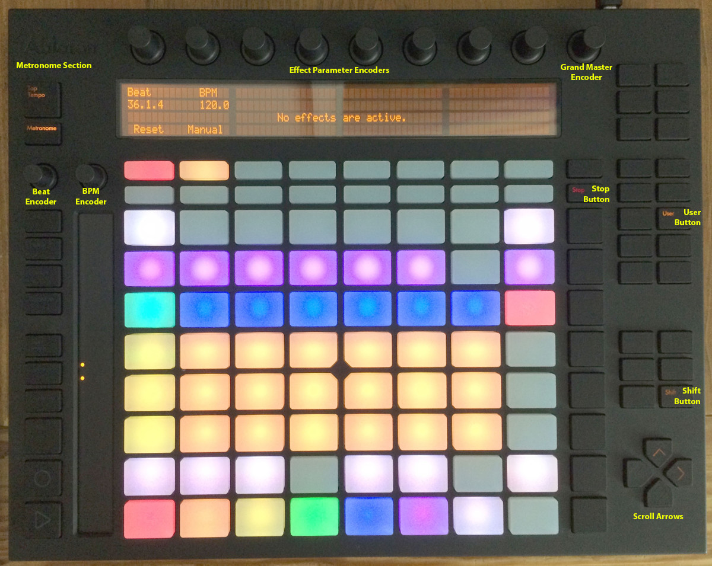
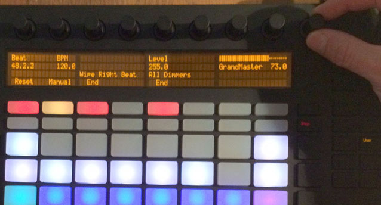
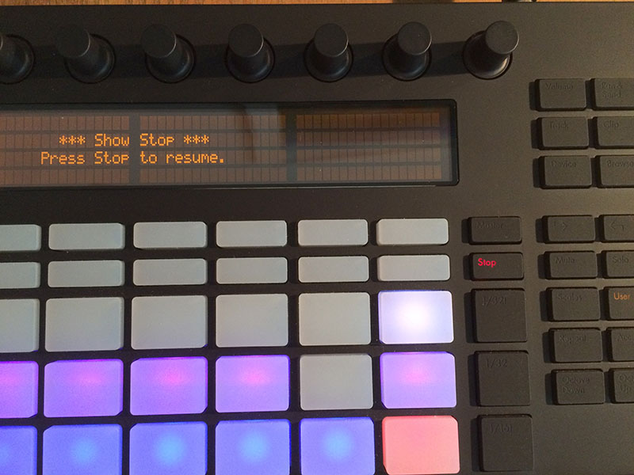
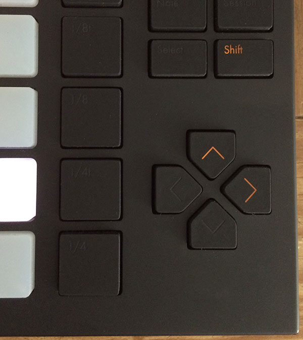
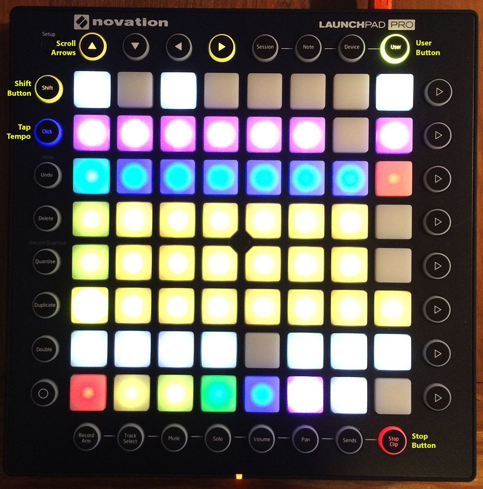
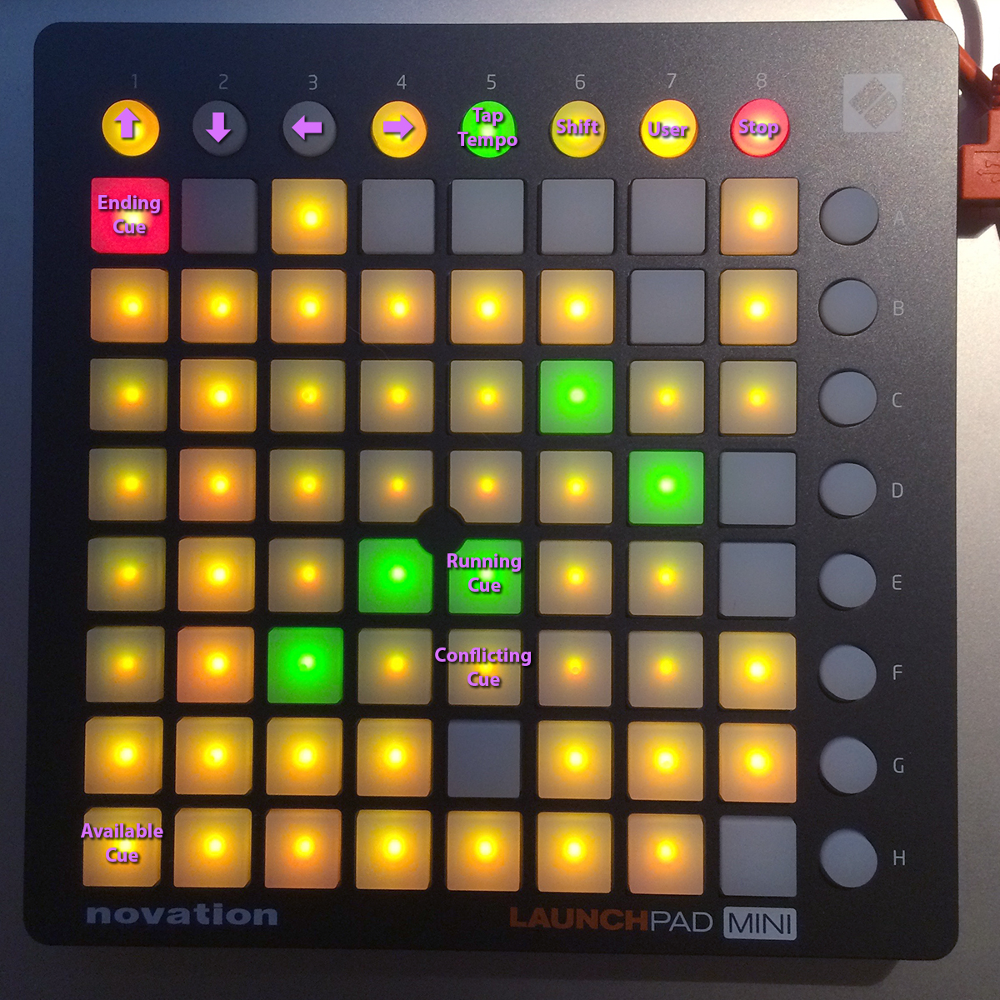

= MIDI Mapping and Beat Sync
James Elliott <james@deepsymmetry.org>
:icons: font
:experimental:
:toc:
:toc-placement: preamble
:api-doc: http://rawgit.com/brunchboy/afterglow/master/api-doc/

// Set up support for relative links on GitHub; add more conditions
// if you need to support other environments and extensions.
ifdef::env-github[:outfilesuffix: .adoc]

Afterglow is designed to work with MIDI controllers and DJ equipment.
You can bind physical controller elements to trigger cues and adjust
show variables, and sync the BPM of the show master metronome to MIDI
clock pulses from a DJ controller or mixer. (Although if you have
professional Pioneer gear, you are better off syncing the metronome to
the Pro DJ Link via an Ethernet cable.)

NOTE: These examples assume you are in a Clojure REPL with Afterglow loaded,
in the namespace `afterglow.examples`. This is the default namespace you
get if you check out the project and run `lein repl`. The sample show is
assumed to be running; if not, `(show/start!)`

== Mapping Cues to a Controller

Although the most convenient and powerful way of running cues with
Afterglow is to use a large grid controller with color feedback (like
the Ableton Push or Novation Launchpad Pro, which can mirror the cue
grid of the web interface) you can still accomplish a great deal with
a simple controller with a few buttons. You will still want to start
by creating the cues in the show cue grid, not only so you can see and
manipulate them with the web interface, but also because that is how
they can be mapped to MIDI controllers. (The
<<mapping_sync#using-ableton-push,Push>> and
<<mapping_sync#using-launchpad-pro,Launchpad family>> mappings are
described in detail below.)

First you need to identify the MIDI messages that the controller sends
when you press and release the interface element you want to assign
the cue. Afterglow can help with that too, as described
<<finding-mapping-details,below>>. Once you have the cue created and
the control identified, you can create the mapping using
{api-doc}afterglow.effects.cues.html#var-add-midi-to-cue-mapping[`afterglow.effects.cues/add-midi-to-cue-mapping`], like:

[source,clojure]
----
(cues/add-midi-to-cue-mapping "nano" 0 :control 46 0 6)
----

This would cause Afterglow to start or stop the cue at grid position
(0, 6) when a pad on the device named "nano" is pressed and sends a
MIDI control change message on control number 46. See the
{api-doc}afterglow.effects.cues.html#var-add-midi-to-cue-mapping[documentation]
for details on all the arguments.

TIP: If the controller has LEDs associated with the controls, and you
can configure it so that its LEDs are in external control mode,
Afterglow will even give you feedback about when the cue is running,
by lighting up the pad or button when the cue starts (whether or not
you started it using this controller), and darkening it when the cue
ends. If you are unable to configure your controller in this way, or
there is some other reason why you want to avoid having Afterglow send
it MIDI messages about the cue status, pass the additional arguments
`:feedback-on false` to `add-midi-to-cue-mapping`. See the
function
{api-doc}afterglow.effects.cues.html#var-add-midi-to-cue-mapping[documentation]
for full details.

If you want to be able to later remove this cue mapping, be sure to
save the value returned by `add-midi-to-cue-mapping` in a
variable, because you will need to pass it to
{api-doc}afterglow.effects.cues.html#var-remove-midi-to-cue-mapping[`remove-midi-to-cue-mapping`].
Or you can simply disconnect the controller from your system, and
Afterglow will clean up any mappings that had been assigned to it.

Also be sure to see the section
<<automatically-creating-bindings-when-a-device-connects,below>>
that explains how you can arrange to have afterglow automatically call
the relevant MIDI mapping functions to set up your device whenever it
is connected.

NOTE: If you are mapping a cue that is set up with velocity sensitive
variables, and your controller is not actually velocity-sensitive, you
might find the cue being activated more intensely than you like,
because the controller is always sending maximum velocity values when
pressed. You can work around this by passing the optional
`:use-veolocity` argument along with an explicit velocity value from
`0` to `127` to `add-midi-to-cue-mapping`. This will cause the
mapping to act as if the button was pressed with the velocity you
specified here, allowing you to choose the values with which the cue
gets activated.

== Mapping a Control to a Variable

You can also tie an encoder or fader on a MIDI control surface to a
show variable, so that turning the encoder or sliding the fader
changes the value of the variable. If you have set up cues to look at
that variable, through <<cues#cue-variables,cue-specific variable
bindings>>, the control surface can then vary the look of the effect
created by the cue, both before the cue is launched, and while it is
running.

Here is a lower-level example of how I can use
{api-doc}afterglow.show.html#var-add-midi-control-to-var-mapping[`add-midi-control-to-var-mapping`]
have a knob on one of my
simple MIDI controllers set the hue of all the lights. It shows up
with a MIDI port name of `SLIDER/KNOB`, and its first rotary
controller is control 16 on channel 0. I can map that to set a show
variable `knob-1` to the values 0-360 (the legal hue values):

[source,clojure]
----
(show/add-midi-control-to-var-mapping "Slider" 0 16 :knob-1 :max 360)
----

NOTE: See the
{api-doc}afterglow.show.html#var-add-midi-control-to-var-mapping[documentation]
for details about all the arguments. Also, if you want to map a color
component like this, there is a
<<mapping-a-control-to-a-color-component,better way>> to do it that
makes it easier to work with the color in the web interface.

Then I can create a global color effect based on that variable:

[source,clojure]
----
(show/add-effect! :color (global-color-effect
  (params/build-color-param :s 100 :l 50 :h :knob-1)))
----

It is also possible to perform arbitrary transformation of the MIDI
value before storing it into the show variable, by passing
`add-midi-control-to-var-mapping` a transformation function using the
optional keyword argument `:transform-fn`. The function you supply
will called with the MIDI value (already scaled, if you passed a value
with `:min` or `:max`), and whatever it returns will be stored in the
variable. Your function can contain whatever logic it needs, and does
not even need to return a number. As a simple example, suppose you
want to set up a `:beat-ratio` variable for configuring oscillators,
and you want it to have the value 1, 2, 4, or 8, depending on how far
a fader is raised. Since those are all powers of two, you could
implement the varible binding like this:

[source,clojure]
----
(show/add-midi-control-to-var-mapping
  "SLIDER" 0 1 :beat-ratio :max 3
  :transform-fn (fn [v] (Math/pow 2 (Math/round v))))
----

NOTE: This intercepts any MIDI control-change messages for the device
whose name or description contains "SLIDER", on channel 0, controller
number 1. It scales the incoming control value to the range 0 through
3, then calls a custom function which rounds the scaled value to the
nearest integer, and raises 2 to that power. The result gets stored
into the show variable `:beat-ratio`.

If you want to be able to later remove this variable mapping, be sure
to save the value returned by `add-midi-control-to-var-mapping` in a
variable, because you will need to pass it to
{api-doc}afterglow.midi.html#var-remove-control-mapping[`remove-control-mapping`].
Or you can simply disconnect the controller from your system, and
Afterglow will clean up any mappings that had been assigned to it.

Also be sure to see the section
<<automatically-creating-bindings-when-a-device-connects,below>>
that explains how you can arrange to have afterglow automatically call
the relevant MIDI mapping functions to set up your device whenever it
is connected.

== Finding Mapping Details

In the all-too likely event you don’t have all your MIDI port names and
control channel and note numbers memorized, Afterglow can help. Just
run...

[source,clojure]
----
(afterglow.midi/identify-mapping)
----

...then twiddle the knob, slide the fader, or press the button you
wish to map. Afterglow will report the first control-change or note
message it receives:

[source,clojure]
----
{:command :control-change, :channel 0, :note 32, :velocity 127,
 :device {:name "SLIDER/KNOB",
          :description "nanoKONTROL2 SLIDER/KNOB"}}
----

____
Notice that even for control changes, the controller number is
identified as `:note` (32 in this example).
____

If nothing is received for ten seconds, it will give up:

[source,clojure]
----
nil
----

If this happens, and you are sure the device is connected, you will
need to troubleshoot your MIDI setup. If you are on a Mac, and the
device was not connected when you started Afterglow, be sure that you
have installed
https://github.com/DerekCook/CoreMidi4J/releases[CoreMIDI4J] as
discussed on the
https://github.com/brunchboy/afterglow/wiki/Questions#midi-from-java-on-the-mac[Afterglow
Wiki].

NOTE: These examples show how to perform low-level MIDI mapping. Over
time, you might find that someone has written a rich user interface
binding for your controller, as has been done for the
<<mapping_sync#using-ableton-push,Ableton Push>>, which would let you
jump right in without having to worry about such details. These
examples can still help explain how your controller's binding works,
or encourage you to write and share a binding for a new controller
that you happen to have.

== Automatically Creating Bindings When a Device Connects

You can tell Afterglow to watch for a particular device to be
connected and call a function whenever it is present. This function
can set up all of the MIDI bindings you want for that device. This is
convenient because if the device is not there, nothing will happen
(and there will be no errors), but if it is, the bindings will be set
up. Even more importantly, in a performance context, if the device is
accidentally disconnected or powered down, the bindings will be
reconfigured as soon as it is reconnected.

To do this, set up a function like `map-nano` in the example below
which creates all the MIDI bindings you want for your device, and then
call
{api-doc}afterglow.midi.html#var-watch-for[`afterglow.midi/watch-for`]
to cause that function to be called whenever a device with a matching
name or description is connected:

[source,clojure]
----
(defn map-nano []
  (cues/add-midi-to-cue-mapping "nano" 0 :control 46 0 6)
  (show/add-midi-control-to-var-mapping "nano" 0 16 :knob-1 :max 360))

(afterglow.midi/watch-for "nano" map-nano)
----

TIP: If you want to be able to cancel the watcher later, be sure to
save the value returned by `watch-for` in a variable. The return value
is a function which cancels that watcher when you call it.

See the `watch-for`
{api-doc}afterglow.midi.html#var-watch-for[documentation]
for details about other ways you can configure it, such as adjusting
how long it waits for the new device to stabilize before calling your
function, and how to provide another function that gets called to
clean up when the device is disconnected. You do not need to worry
about cleaning up ordinary MIDI bindings, since Afterglow
automatically does that whenever a device is disconnected, but if you
have set up any of your own state that you would like to remove, you
can use this mechanism to do so.

== Mapping a Control to a Color Component

When you are working with colors for cues, Afterglow lets you put a
<<color.adoc#working-with-color,color object>> in a show variable or
cue parameter, rather than simply storing individual numeric
components like the hue. Doing this lets the web and Ableton Push
interfaces give the user a rich color picker interface for adjusting
that variable or parameter, so it is usually a better approach than
just storing the numbers that make up the color.

When you do that, you can still use any MIDI controller to adjust
components of that color, using
{api-doc}afterglow.controllers.color.html#var-add-midi-control-to-color-mapping[`afterglow.controllers.color/add-midi-control-to-color-mapping`].

Here is an example of how to tie the left six faders on one of my
simple MIDI controllers to adjust all of the components that make up
the color used by the sample show's strobe effects. The controller
shows up with a MIDI port name of `SLIDER/KNOB`, and its fader
controllers are controls 0 through 7 on channel 0. Assigning the
first six to adjust components of the strobe color looks like:

[source,clojure]
----
(require '[afterglow.controllers.color :as color-ctl])
(color-ctl/add-midi-control-to-color-mapping "SLIDER" 0 0 :strobe-color :red)
(color-ctl/add-midi-control-to-color-mapping "SLIDER" 0 1 :strobe-color :green)
(color-ctl/add-midi-control-to-color-mapping "SLIDER" 0 2 :strobe-color :blue)
(color-ctl/add-midi-control-to-color-mapping "SLIDER" 0 3 :strobe-color :hue)
(color-ctl/add-midi-control-to-color-mapping "SLIDER" 0 4 :strobe-color :saturation)
(color-ctl/add-midi-control-to-color-mapping "SLIDER" 0 5 :strobe-color :lightness)
----

NOTE: See the
{api-doc}afterglow.controllers.color.html#var-add-midi-control-to-color-mapping[documentation]
for details about all the arguments; this simple example assumes you
want to access the full range of each color component and that higher
MIDI values should map to higher color values. Also, even though it is
included here for completeness, there is no point in assigning a value
to the `:strobe-color` variable's `:lightness` component, since that
is under the control of the strobe cue.

With this done, as I move the sliders on this MIDI controller, I can
see the colors of the strobe cues in the web interface and on the
Ableton Push and Novation Launchpad grids changing (and on the lights
themselves if any strobe cue is running at the time).

== Mapping a Control to a Dimmer Master

The web interface and Ableton Push mapping have dedicated interfaces
for controlling the show's dimmer grand master, but you can map any
MIDI controller fader or rotary controller to it, or to any other
dimmer master that you have created to control your cues, using
{api-doc}afterglow.show.html#var-add-midi-control-to-master-mapping[`add-midi-control-to-master-mapping`].

Here is an example of how to tie the leftmost fader on one of my
simple MIDI controllers to the show's dimmer grand master. The
controller shows up with a MIDI port name of `SLIDER/KNOB`, and its
first fader controller is control 0 on channel 0. I can map that to
set the show grand master to the values 0-100 (the legal dimmer master
values) by simply calling:

[source,clojure]
----
(show/add-midi-control-to-master-mapping "Slider" 0 0)
----

NOTE: See the
{api-doc}afterglow.show.html#var-add-midi-control-to-master-mapping[documentation]
for details about all the arguments; this simple call takes advantage
of the fact that the show dimmer grand master is the default master if
you don't pass one in with `:master`.

== Mapping Metronome Control

The rich grid controller bindings created for the Ableton Push and
Novation Launch Pad provide very convenient metronome control using
Tap Tempo buttons that flash on each beat of the show metronome, and
respond to taps appropriately for any metronome synchronization (as
described in the <<syncing-to-midi-clock,next sections>>) the show may
have established.

Even if you don't have such a controller, you can set up a button or
pad on any MIDI controller you own to work the same way. Simply
<<finding-mapping-details,identify the mapping>> you need to interact
with that button or pad as decribed above, then call
{api-doc}afterglow.controllers.tempo.html#var-add-midi-control-to-tempo-mapping[`afterglow.controllers.tempo/add-midi-control-to-tempo-mapping`]
to set it up.

NOTE: As with cue mappings, these mappings work best if you can
configure your controller so that its LEDs are in external control
mode (instead of local control mode), so that Afterglow is completely
in control of when they are lit. If you can't do that, of there is
some other reason why you want to avoid having Afterglow send MIDI
messages to try to control the LEDs, you can pass the additional
arguments `:feedback-on false` when setting up the mappings. Of course
this will mean that the Tap Tempo button can't blink on beat for you.

For example, to set this up for the kbd:[Record] button on a Korg
nanoKONTROL2 controller, you can call:

[source,clojure]
----
(def tempo-map
  (afterglow.controllers.tempo/add-midi-control-to-tempo-mapping
    "nano" 0 :control 45))
----

> See the
{api-doc}afterglow.controllers.tempo.html#var-add-midi-control-to-tempo-mapping[documentation]
for details about all the arguments.

From that point on, the kbd:[Record] button blinks on each beat of the
show metronome, and when you press the button, it adjusts the tempo of
the show. Assuming you have no metronone synchronization established
for the show, tapping the button sets the metronome's BPM. Tap it as
you hear each beat of the music, and after a few taps, the speed of
the metronome will be approximately synchronized with the music.

NOTE: To synchronize the actual beats themselves, see the discussion
about how to pair this mapping with a shift button, coming up shortly.

If the metronome's BPM is already being synced automatically, via MIDI
clock messages as described in the <<syncing-to-midi-clock,next
section>>, then tapping the button will not change the BPM. Instead,
it acts as a Tap Beat button, moving the start of the current beat to
match when you tapped the button.

If the metronome's BPM and beat positions are both being synced
automatically, either via the <<syncing-to-traktor-beat-phase,Traktor
beat phase mapping>> or <<syncing-to-pro-dj-link,Pioneer Pro DJ Link>>
(as described further below) then tapping the button acts as a Tap Bar
button, telling Afterglow that the closest beat to when you tapped the
button is the down beat, the start of the current bar.

In addition to Tap Tempo buttons, the grid controllers have Shift
buttons which modify the behavior of other buttons, including the Tap
Tempo button. That can be very convenient, especially when you are not
using any kind of automatic BPM sync, so you want to be able to set
both the tempo and the beat location. You can set up another button on
your controller to act this way and work with your Tap Tempo button,
but you need to map it before mapping the Tap Tempo button, so you can
make use of it in setting up the Tap Tempo mapping.

To set up a Shift button on any MIDI controller you happen to have,
start by <<finding-mapping-details,identifying the mapping>> you need
to interact with the button or pad you want to use, then call
{api-doc}afterglow.controllers.tempo.html#var-add-midi-control-to-shift-mapping[`afterglow.controllers.tempo/add-midi-control-to-shift-mapping`]
to set it up.

For example, to set this up for the kbd:[Play] button on a Korg
nanoKONTROL2 controller, you can call:

[source,clojure]
----
(def shift-map
  (afterglow.controllers.tempo/add-midi-control-to-shift-mapping
    "nano" 0 :control 41))
----

> See the
{api-doc}afterglow.controllers.tempo.html#var-add-midi-control-to-shift-mapping[documentation]
for details about all the arguments.

Once you've done that, when you hold down that button Afterglow lights
it up, and when you release it Afterglow darkens it. But more
importantly, you can use the value it returned to set up a
relationship between your Shift button and a Tap Tempo button:

[source,clojure]
----
(def tempo-map
  (afterglow.controllers.tempo/add-midi-control-to-tempo-mapping
    "nano" 0 :control 45 :shift-fn (:state shift-map)))
----

This tells Afterglow to check the state of your Shift button whenever
you it your Tap Tempo button. If the Shift button is not held down,
the Tap Tempo button acts as described above, but if your Shift button
_is_ being held down, tempo taps act differently, synchronizing at one
level higher.

So if your show metronome is unsynchronized, and the Tap Tempo button
would normally set the BPM, then tapping it while holding down your
Shift key makes it act as a Tap Beat button, moving the start of the
current beat to match when you tapped the button.

If the metronome's BPM is already being synced automatically so the
button would normally act as a Tap Beat button, then with Shift down
it acts as a Tap Bar button, telling Afterglow that the closest beat
to when you tapped the button is the down beat, the start of the
current bar.

And if the BPM and beat positions are already being synced
automatically so the button would normally act as a Tap Bar button,
then with Shift down it acts as a Tap Phrase button, telling Afterglow
that the closest beat to when you tapped the button is the start of an
entire phrase.

If you ever want to stop using the mapped buttons, there is a function
to remove MIDI mappings. This would undo what we did above:

[source,clojure]
----
(afterglow.midi/remove-control-mapping "nano" 0 :control 45 tempo-map)
(afterglow.midi/remove-control-mapping "nano" 0 :control 41 shift-map)
----

Simply detaching the MIDI controller also automatically removes any
mappings that were created for it.

== Syncing to MIDI Clock

Many DJ mixers automatically send MIDI clock pulses to help synchronize
to their BPM. Pioneer’s Nexus mixers send MIDI clock over both their
physical MIDI connection, and over USB if you are connected that way,
conveniently. But they offer far more useful sync information over the
Ethernet port via Pro DJ Link packets, which Afterglow
<<syncing-to-pro-dj-link,can also process>>.

If you are using a mixer or DJ software like Traktor which supports only
MIDI clock sync, it is a lot better than nothing! Here is how to take
advantage of it.

TIP: Native Instruments has an informative Knowledge Base article
which
http://www.native-instruments.com/en/support/knowledge-base/show/750/how-to-send-a-midi-clock-sync-signal-in-traktor/[explains]
how to configure Traktor to send the MIDI clock pulses that Afterglow
can sync to. Also see
<<mapping_sync#syncing-to-traktor-beat-phase,below>> for how to sync
to the actual beat phase information when you are using Traktor.

Once you have your MIDI clock pulses reaching the system on which
Afterglow is running, start Afterglow. Because of limitations inherent
in the Java MIDI API, only MIDI devices which were connected when the
program started are available to it. Then, assuming you have only one
device sending MIDI clock, you can just execute:

[source,clojure]
----
(show/sync-to-external-clock (afterglow.midi/sync-to-midi-clock))
----

If there is ambiguity about which device’s MIDI clocks you want to
process, Afterglow will complain. Resolve that by passing a device
filter which matches the device you want to use. The simplest kind of
filter you can pass is a string, which uniquely matches the name or
description of the MIDI device that you want to sync to:

[source,clojure]
----
(show/sync-to-external-clock
  (afterglow.midi/sync-to-midi-clock "traktor"))
----

The documentation for
{api-doc}afterglow.midi.html#var-filter-devices[`afterglow.midi/filter-devices`]
explains the other kinds of device filter you can use.

NOTE: This section describes the low-level mechanisms available for
establishing MIDI sync from code and the REPL. A much easier way is to
just click the Sync button in the Metronome section at the bottom of
the <<README#the-embedded-web-interface,embedded Web interface>>.

From then on, as the BPM of that device changes, Afterglow will track it
automatically. To check on the sync status, you can invoke:

[source,clojure]
----
(show/sync-status)
; -> {:type :midi, :status "Running, clock pulse buffer is full."}
----

The calculated BPM of the synced show can be displayed like this:

[source,clojure]
----
(metro-bpm (:metronome sample-show))
; -> 128.5046728971963
----

It will bounce up and down near the actual BPM as clock pulses are
received, but overall track the beat quite well. To get a rock-solid
beat lock you need to have equipment that can provide Pro DJ Link
syncing, as described below.

To shut down the syncing, just call `sync-to-external-clock` with no
sync source:

[source,clojure]
----
(show/sync-to-external-clock)
(show/sync-status)
; -> {:type :manual}
----

== Syncing to Traktor Beat Phase

If you are using Traktor as your source of MIDI clock synchronization,
even though you cannot quite attain the kind of smoothly precise BPM
lock as you can with <<mapping_sync#syncing-to-pro-dj-link,Pro DJ
Link>>, you can configure Traktor to send its beat phase information
in a way that Afterglow can detect and analyze, giving you the same
kind of beat grid synchronization.

In order to do that, download and unzip the Afterglow Traktor
Controller Mapping,
https://raw.githubusercontent.com/brunchboy/afterglow/master/doc/assets/Afterglow.tsi.zip[Afterglow.tsi],
and import it into Traktor.

WARNING: Be sure to use the following steps to import the mapping,
which will add it to any other mappings or settings you have already
set up in Traktor. If you instead use the obvious and tempting
`Import` button at the bottom of the Preferences window, you will
replace--rather than add to--your settings.

1. Open the Traktor Preferences.

2. Choose the `Controller Manager` section from the menu down the right.

3. Click the `Add...` button in the `Device Setup` section at the top:
+
image::assets/TraktorAddMapping.png[Traktor Add Device Mapping]

4. Choose `Import TSI` in the menu which pops up, and `Import
Other...` at the bottom of the menu which that opens:
+
image::assets/TraktorImport.png[Traktor Import Other TSI]

5. Navigate to the folder containing the `Afterglow.tsi` file you
downloaded, and open it.

Following this procedure will create a Device named `Clock,
Afterglow` within the Traktor Controller Manager:

image::assets/TraktorMapping.png[Afterglow Traktor Device Mapping]

Select and use that rather than the Generic MIDI device you would
create in the process described in the Traktor Knowledge Base article
linked above, and in addition to sending basic MIDI clock mesages,
Traktor will send special MIDI messages that Afterglow will recognize
and use to remain synchronized to the Traktor beat grid.

[WARNING]
====================================================================
In order to avoid extra MIDI clock pulses being sent, which will cause
the BPM calculations to be wildly incorrect, make sure not to create
more than one Generic MIDI device on the Traktor Virtual Output port.
If you created one following the directions in the Syncing to MIDI
Clock section above, be sure to delete it, and leave only the
Afterglow Traktor controller mapping.

You must still follow the instructions in the Traktor
http://www.native-instruments.com/en/support/knowledge-base/show/750/how-to-send-a-midi-clock-sync-signal-in-traktor/[Knowledge
Base article], starting with step 3.2, to ensure that the `Clock,
Afterglow` device is configured to send MIDI messages to the
appropriate MIDI output port, and step 4, which configures Traktor to
send MIDI clock.
====================================================================

The way the Afterglow mapping works is that it sends out Control
Change messages for all currently playing decks. These messages
communicate the current beat phase on that deck. (Deck A is sent as
controller `1`, B as controller `2`, C as controller `3`, and D as
controller `4`). In order for Afterglow to know which deck to pay
attention to if more than one is playing at the same time, whenever a
different deck becomes the Tempo Master, a message identifying the new
Master deck is sent out as a Control Change message on controller `0`.
(The same number to deck correspondence is used.) When no deck is
Tempo Master, a Control Change with value `0` is sent on controller
`0`.

Whenever Afterglow detects a coordinated stream of messages on
controllers `0` through `4` which are consistent with beat-phase
information from this Traktor mapping, it offers that MIDI input
device as a source of Traktor beat-phase synchronization, and if it is
<<syncing-to-midi-clock,synchronizing a metronome>> with the MIDI
clock messages on that port, will also synchronize the beats.

== Syncing to Pro DJ Link

If you are working with Pioneer club gear, such as the Nexus line of
CDJs and mixers, you can use Pro DJ Link to sync much more precisely.
You just need to be on the same LAN as the gear (most easily by
connecting an Ethernet cable between your laptop running Afterglow and
the mixer, or a hub or router connected to the mixer. You don’t need to
be connected to the Internet, the protocol works fine over self-assigned
IP addresses. You just need to specify which device you want to use as
the source of beat information, and that will generally be the mixer,
since it will track whichever device is currently the tempo master (or
perform BPM analysis if a non-DJ-Link, or even non-digital, source is
being played). Like with MIDI sync, you can give a unique substring of
the device name in the sync call:

[source,clojure]
----
(show/sync-to-external-clock
  (afterglow.dj-link/sync-to-dj-link "DJM-2000"))
----

As with MIDI, you can check on the sync status:

[source,clojure]
----
(show/sync-status)
; -> {:type :dj-link, :status "Running, 5 beats received."}
; -> {:type :dj-link,
;     :status "Network problems? No DJ Link packets received."}
----

TIP: If you are not getting any packets, you will need to put on your
network troubleshooting hat, and figure out why UDP broadcast packets
to port 50001 from the mixer are not making it to the machine running
Afterglow.

== Sending MIDI Over a Network

You can sync MIDI clock and respond to MIDI controller messages from
hardware and software which is not directly attached to the machine
running Afterglow. If you are on a Mac, this capability is built in,
and can be configured using the
https://help.apple.com/audiomidisetup/mac/10.10/index.html?localePath=en.lproj#/ams1012[Audio
MIDI Setup] utility (in the `Utilities` subfolder of your
`Applications` folder). For Windows, you can install the excellent,
free, and fully compatible
http://www.tobias-erichsen.de/software/rtpmidi.html[rtpMIDI] driver.
Either of these approaches allow you to communicate with the network
MIDI capabilities built in to iOS devices and applications.

If you are interested in using Open Sound Control (OSC) control
surfaces with Afterglow, you should also check out the free
http://hexler.net/software/touchosc[TouchOSC] package (also available
for http://hexler.net/software/touchosc-android[Android]). The TouchOSC
site also has a nice
http://hexler.net/docs/touchosc-setup-coremidi-network[illustrated
walk-through] of setting up network MIDI communication.

== Connecting to MIDI Ports on the Same Machine

To achive MIDI routing on a single machine, you need to set up a
virtual MIDI bus. On the Mac you can use Core MIDI's built-in IAC bus,
and on Windows you could use the MIDI Yoke utility. You can find
https://www.ableton.com/en/help/article/using-virtual-MIDI-buses-live/[a
good tutorial] about the needed steps on the Ableton Live website.

== Checking your Sync

An easy way to see how well your show is syncing the beat is to use the
`metronome-effect`, which flashes a bright pink pulse on the down beat, and a
less bright yellow pulse on all other beats of the show metronome. To
set that up:

[source,clojure]
----
(require 'afterglow.effects.fun)
(show/add-effect! :color
  (afterglow.effects.fun/metronome-effect (show/all-fixtures)))
----

Then you can reset the metronome by hitting kbd:[Return] on the following
command, right on the down beat of a track playing through your
synchronized gear, and watch how Afterglow tracks tempo changes made by
the DJ from then on:

[source,clojure]
----
(metro-start (:metronome sample-show) 1)
----

When running live light shows you will almost certainly want to map a
button on a MIDI controller to perform this beat resynchronization
(although it is not necessary when you are using Pro DJ Link to
synchronize with your mixer—but even then you will likely want the next
two functions mapped, for realigning on bars and phrases). Here is how I
do it for one of the buttons on my Korg nanoKontrol 2:

[source,clojure]
----
(show/add-midi-control-metronome-reset-mapping "slider" 0 45)
----

Then, whenever I press that button, the metronome is started at beat 1,
bar 1, phrase 1.

You can add mappings to reset metronomes which are stored in show
variables by adding the variable name as an additional parameter at the
end of this function call.

As noted above, even when you have a rock solid beat sync with your
mixer, you sometimes want to adjust when bars or phrases begin,
especially when tricky mixing has been taking place. You can accomplish
this by mapping other buttons with
`add-midi-control-metronome-align-bar-mapping` and
`add-midi-control-metronome-align-phrase-mapping`. These cause the MIDI
control to call `metro-bar-start` and `metro-phrase-start` on the
associated metronome to restart the current bar or phrase on the nearest
beat, without moving the beat. This means you do not need to be as
precise in your timing with these functions, so you can stay beat-locked
with your synch mechanism, much like the “beat jump” feature in modern
DJ software.

If the metronome flashes start driving you crazy, you can switch back to
a static cue,

[source,clojure]
----
(show/add-effect! :color blue-effect)
----

or even black things out:

[source,clojure]
----
(show/clear-effects!)
----

== Using Ableton Push

Some controllers have such rich capabilities that they deserve their
own custom mapping implementations to exploit their capabilities as a
show control interface. The Ableton Push is one, and a powerful
{api-doc}afterglow.controllers.ableton-push.html[mapping]
is being created. You can already use it to do most of the things that
you would use the <<README#the-embedded-web-interface,web interface>>
for, and often with deeper control, since you can press multiple cue
trigger pads at the same time, and they respond to variations in
pressure.

NOTE: Currently only the original Push hardware is supported. Brief
experiments with a Push 2 which was loaned for the purpose show that
the color display does not use MIDI, so it is going to be challenging
to support, the grid pads use a different color scheme, and no
mehanism for specifying a RGB pad color has yet been discovered. Any
pointers to documentation or open-source implementations of these
features on Push 2 would be greatly appreciated, and might make
support possible!

Assuming you have an Ableton Push connected to the machine running
Afterglow, you can activate the Push mapping and attach it to the
current default show like this:

[source,clojure]
----
(require '[afterglow.controllers.ableton-push :as push])
(def watcher (push/auto-bind *show*))
----

You will see a brief startup animation, and Afterglow's Push interface
will start. (This also arranges for the Push to be re-bound to the
show if it gets disconnected or powered off and then reappears, which
is very handy in a performance setting.) Here is an overview of how
the Push mapping works:

=== Show Control

Once you have the Push linked to a show, it becomes a very intuitive
way to monitor and control the cues and other aspects of the show.

The text area at the top of the Push displays the effects currently
running, and can optionally display
<<mapping_sync#metronome-control,metronome>> information as well. If a
cue was defined with adjustable parameters for its effect, they will
also be displayed in the text area, and you will be able to
<<mapping_sync#effect-control,adjust>> them by turning the encoder
above the parameter.

The rightmost encoder, past the text area, adjusts the show Grand
Master, which controls the maximum brightness that any dimmer cue can
achieve, so you can always use it to adjust the overall brightness of
the show. As soon as you touch the encoder, the current Grand Master
level will appear, and be updated as you turn the encoder. When you
release it, the display returns to showing whatever it was before.

The red kbd:[Stop] button to the right of the top of the cue grid can be
used to temporarily shut down the show, blacking out all universes
that it controls, and suspending the processing of its effects.

Pressing it again restarts the show where it would
have been had it not stopped.

=== Cues

Most of the space on the interface is dedicated to an 8&times;8 grid
of color coded cue trigger pads, which provide a window onto the
show's overall <<cues#cues,cue grid>>. The Push can be
<<README#scrolling-and-linked-controllers,linked>> to the
<<README#the-embedded-web-interface,web interface>> so that both
always display the same section of the cue grid, and the web interface
can remind you of the names of the cues you are looking at, or it can
be scrolled independently, allowing you access to more cues at the
same time.

TIP: If you have more than one compatible grid controller, you can
have Afterglow using all of them at the same time; each can be
scrolled to different areas of the cue grid, and each can even be
linked to a different browser window if you have that much screen
space.

You can activate any cue shown by pressing its pad; running cues will
light up, and darken again when they end. The effects which cues
create will also appear in the text area above the cue pad, from left
to right, with the most recent effect on the right. In the photo
below, &ldquo;Sparkle&rdquo; is the most recent effect, and it has two
parameters, `chance` and `Fade`, which can be adjusted by turning the
encoders above them. The `chance` value is changing rapidly because it
is configured to also be adjusted through the pressure sensitive cue
pad that was used to launch it.

image::assets/SparklePressure.jpg[Sparkle effect, ajusting chance variable]

To stop a running cue, press its pad again, or press the red kbd:[End]
pad underneath its effect entry in the text area. Some cues will end
immediately, others will continue to run until they reach what they
feel is an appropriate stopping point. While they are in the process
of ending, the cue pad will blink, and the kbd:[End] pad will be
labeled kbd:[Ending]. If you want the cue to end immediately even
though it would otherwise run for a while longer, you can press the
blinking cue pad (or effect kbd:[Ending] pad) again and it will be
killed right then.

The colors assigned to cue pads by the creator of the cue grid are
intended to help identify related cues. Some cues (especially intense
ones like strobes) are configured to run only as long as they are held
down. In that case, when you press cue pad, it lights up with a
whitened version of the cue color as a hint that this is happening,
and as soon as you release the pad, the cue will end. If you want to
override this behavior, you can hold down the kbd:[Shift] button
(towards the bottom right of the Push) as you press the cue pad, and
it will activate as a normal cue, staying on until you press it a
second time.

As noted above, cues can also be configured to take advantage of the
pressure sensitivity of the Push cue pads, so that as you vary the
pressure with which you are holding down the pad, some visible
parameter of the cue is altered. The strobe and sparkle cues in
created by
{api-doc}afterglow.examples.html#var-make-cues[`afterglow.examples/make-cues`]
for the sample show work this way: the intensity and lightness of the
strobe are increased by pressure, and so is the chance that a sparkle
will be assigned to a light on each frame. You can see these
parameters change in the text area above the cue's effect name while
you are adjusting them, as shown in the photo above.

[[exclusivity]]Cues may be mutually exclusive by nature, and if they
were created to reflect this (by using the same keyword to register
their effects with the show, or specifying other effect keys in their
`:end-keys` list), when you activate one, the other cues which use the
same keyword are dimmed. This is a hint that when you activate one of
them, it will _replace_ the others, rather than running at the same
time. In the photo <<mapping_sync#gobo-photo,below>>, the rest of the
Torrent 1 fixed gobo cues (the leftmost blue cues) are dimmed because
they would replace the running &ldquo;T1 atom shake&rdquo; cue.

=== Scrolling

The show will likely have many more cues than fit on the pad grid; the
diamond of arrow buttons at the bottom right allow you to page through
the larger show grid. If there are more cues available in a given
direction, that arrow will be lit, otherwise it is dark. Pressing an
active arrow scrolls the view one &ldquo;page&rdquo; in that
direction. In the photo below, it is currently possible to scroll up
and to the right:

If you hold down the kbd:[Shift] button, the arrows gain a different
purpose, allowing you to scroll the text display left and right, to
see and <<mapping_sync#effect-control,adjust>> all of the currently
running effects, even though only four at a time (or three, if the
<<mapping_sync#metronome-control,metronome section>> is showing) fit
in the display. Pressing the left or right arrows scrolls the next
group of effects in that direction into view; pressing the up arrow
scrolls to the oldest (leftmost) effect, and pressing the down arrow
scrolls to the most recent (rightmost) effect. While kbd:[Shift] is
pressed, the arrows will light up according to whether they can scroll
effects rather than cues in the corresponding direction.

=== Effect Control

As described above, the effects created by cues appear in the text
display area, and can be scrolled through and ended by pressing the
corresponding red kbd:[End] pad which appears underneath them.

==== Numeric Cue Parameters

If the cue that created an effect has numeric parameters assigned to
it, the parameter names and values will appear above the effect name,
and they can be adjusted using the encoder knob above the parameter.
For example, in addition to varying the sparkle `chance` parameter
using the pad pressure, as was done above, its `Fade` parameter can be
adjusted using the effect parameter encoder above it. As soon as you
touch the encode knob associated with a parameter, a graphical
representation of the current value replaces its name, and updates as
you turn the encoder to change the value.

image::assets/AdjustingFade.jpg[Adjusting Fade parameter]

If an effect has only one adjustable parameter, it will take up the
entire effect area, and you can use either encoder to adjust it, as
when adjusting a Focus <<cues#creating-function-cues,function cue>>
for the Torrent moving head spot:

[[gobo-photo]]
image::assets/AdjustingFocus.jpg[Adjusting Focus cue]

When you release the encoder knob, the adjustment graph disappears,
and the parameter name reappears.

The <- indicator at the left of the text area in the above photo is an
indicator that there are older effects which have been scrolled to the
left, off the display. You will see -> at the bottom right of the
display when there are newer effects to the right. You can scroll to
them using the kbd:[Shift] button with the scroll arrow buttons as
described <<mapping_sync#scrolling,above>>.

This photo also illustrates the dimming of incompatible cues discussed
<<mapping_sync#exclusivity,above>>: The leftmost columns of blue cues
all establish settings for the fixed gobo wheel of one of the Torrent
moving-head spots. Since one of them is active (the `T1 atom
shake` effect at the left of the text area corresponds to the
bright blue button three rows down the second column), the others are
dimmed to hint that pressing them would replace the active cue.

This dimming can also be seen in the web interface view of the cue grid:

image::assets/GoboCues.png[Gobo cues]

==== Color Cue Parameters

If a cue has color parameters assigned to it, they will also appear
above the effect name. The currently assigned color value will be
displayed as a six digit hexadecimal number, representing the eight
bit red, green, and blue representation of the color value, #rrggbb.
In this photo, a cue with a color parameter that starts out white has
just been launched:

image::assets/ColorParam.jpg[Cue with color parameter]

When an effect is displaying a color cue parameter, touching the
associated encoder will open up a special color selection interface,
which takes over the entire cue grid, as well as the effect cell:

image::assets/ColorPalette.jpg[Color adjustment palette]

In addition to adjusting the color's hue and saturation using the
encoders above the effect, you can instantly jump to a color by
tapping any of the pads in the grid, which form a palette of four
saturation levels of hues spread across the rainbow. The four pads on
the bottom right let you select white, medium gray, and black as color
values as well, and the last pad displays a preview of the currently
selected color, rather than doing anything when you press it.

If any pad other than the preview pad matches the currently selected
color, it blinks (regardless of whether you chose that color by
pressing the pad or by turning the encoders).

As soon as you let go of both the hue and saturation encoders, the
palette disappears and the normal cue grid returns.

=== Metronome Control

The top left section of the Push lets you view and adjust the
Metronome that the show is using to keep time with the music that is
being played. Since Afterglow's effects are generally defined with
respect to the metronome, it is important to keep it synchronized with
the music. When active, the metronome section takes over the leftmost
quarter of the text area (so there are room to see only three effects,
rather than the normal four). To toggle the metronome section, press
the kbd:[Metronome] button. It will appear if it was not showing, and
disappear if it was there. The kbd:[Metronome] button is lit more
brightly when the section is active.

The metronome section shows the current speed, in Beats Per Minute, of
the metronome, and the kbd:[Tap Tempo] button label flashes at each beat
(this flashing happens regardless of whether the metronome section is
visible in the text area). The metronome section also shows you the
current phrase number, the bar within that phrase, and the beat within
that bar which has been reached.

image:assets/PushMetronome.jpg[Metronome section]

The most basic way of synchronizing the metronome is to tap the
kbd:[Tap Tempo] button at each beat of the music. After a few taps,
the metronome will be approximately synchronized to the music. Once
the tempo is correct, you can tell Afterglow exactly when the beats
are actually hitting by holding down the kbd:[Shift] button while
pressing kbd:[Tap Tempo]. This combination does not change the tempo,
but tells Afterglow that a beat is occurring right when you hit the
kbd:[Tap Tempo] button. After doing that, you should see the flashes
taking place at the same time as the beats.

You can also adjust the BPM by turning the BPM encoder, which is the
rightmost encoder below the Metronome button:

image:assets/PushBPM.jpg[BPM encoder]

While you are holding this encoder, the symbol `&uparrow;` appears below
the BPM value as a visual reminder of what value you are adjusting.
Turning the encoder clockwise raises the BPM, turning counterclockwise
lowers it. While the metronome section is showing, you can also use
the encoder above the BPM value to adjust it. But you can grab the
dedicated BPM encoder below the kbd:[Metronome] button even when the
metronome section is not showing, and it will appear while you have
the encoder in your hand, so you can adjust the BPM quickly, and then
get back to what you were doing.

If you press the kbd:[Shift] button, the BPM encoder can be used to
adjust the BPM by whole beats rather than tenths. While kbd:[Shift] is
down, the `&uparrow;` will point to the left of the decimal point
rather than to the right of it, and the BPM will change ten times as
quickly as you turn it. You can switch back and forth in the middle of
your adjustments by pressing and releasing the shift key at any time.

In order to make longer chases and effects line up properly with the
music, you will also want to make sure the count is right, that the
beat number shows `1` on the down beat, and that the bar numbers are
right as well, so that the start of a phrase is reflected as bar
number `1`. You can adjust those with the beat encoder, the leftmost
encoder below the metronome button:

image:assets/PushBeat.jpg[Beat encoder]

While you are holding this encoder, the symbol `&uparrow;` appears
below the beat number as a visual reminder of what value you are
adjusting. Turning the encoder clockwise jumps to the next beat,
turning counterclockwise jumps back to the previous one. As a tactile
reminder that you are adjusting whole beats, this encoder moves with a
distinct click as it changes value, while the BPM encoder turns
smoothly as you scroll through fractional BPM values.

While the metronome section is showing, you can also use the encoder
above the Beat value to adjust it. But you can grab the dedicated Beat
encoder below the kbd:[Metronome] button even when the metronome
section is not showing, and it will appear while you have the encoder
in your hand, so you can adjust the beat number quickly, and then get
back to what you were doing.

If you press the kbd:[Shift] button, the Beat encoder can be used to
adjust the current bar within the phrase instead of the current beat.
While kbd:[Shift] is down, the `&uparrow;` will point at the bar
instead of the beat, and turning the encoder will jump that value
forwards or backwards:

image:assets/PushBar.jpg[Bar jumping]

If you know a phrase is about to begin, you can press the red Reset
pad in the metronome section right as it does. This will reset the
count to Phrase 1, Bar 1, Beat 1.

Trying to keep up with tempo changes during dynamic shows can be very
difficult, so you will hopefully be able to take advantage of
Afterglow's metronome synchronization features. If the DJ can send you
<<mapping_sync#syncing-to-midi-clock,MIDI clock pulses>>, or you can
connect via a Local Area Network to Pioneer professional DJ gear to
lock into the beat grid established by
<<mapping_sync#syncing-to-pro-dj-link,Pro DJ Link>>, Afterglow can
keep the BPM (with MIDI) and even the beats (with Pro DJ Link and the
Traktor Afterglow Beat Phase
<<mapping_sync#syncing-to-traktor-beat-phase,controller mapping>>)
synchronized for you. The Sync pad in the Metronome section (showing
`Manual` sync in these photos) will eventually allow you to set this
up, but that is not yet implemented, so for now you will need to use
the <<README#metronome-control,web interface>> to configure it.

NOTE: The pad does already change color to let you know the sync
status: amber means manual, green means successful automatic sync, and
red means a requested automatic sync has failed. It is likely that a
future release of Afterglow will let you press this pad to choose your
sync source.

Once your sync is established, the meaning of the kbd:[Tap Tempo]
button changes. If you are using MIDI clock to sync the BPM, it
becomes a kbd:[Tap Beat] button, which simply establishes where the
beat falls. If you are locked in to a Pro DJ Link beat grid or using
the Traktor beat phase mapping, the beats are automatically aligned
for you so, it becomes a kbd:[Tap Bar] button which, when pressed,
indicates that the current beat is the down beat (start) of a bar.
(Similarly, if you press the metronome kbd:[Reset] pad while synced to
a Pro DJ Link beat grid or Traktor beat phase, the beat itself will
not move, but the beat closest to when you pressed the pad will be
identified as Beat 1.) In these sync modes you can also use the
kbd:[Shift] button to align at the next bigger boundary: If tapping
would normally move the beat, shift-tapping will move the bar; if
tapping would normally move the bar, shift-tapping will move the
phrase.

If you try to adjust the BPM encoder while sync is active, it will
have no effect, and Afterglow will point at the sync mode to explain
why it is ignoring your adjustments.

=== Sharing the Push

If you are using Afterglow at the same time as Ableton Live, you can
switch back and forth between which has control of the Push by
pressing the kbd:[User] button. If Live is not running when you press
kbd:[User], the Push interface will simply go blank (except for the
kbd:[User] button itself), until you press it again, at which point
Afterglow will light it up.

NOTE: Future releases will also take advantage of more of the buttons
on the controller, as well as the nice big touch strip to the left of
the cue grid.

== Using Launchpad Pro

Although when compared with the Ableton Push it lacks a text display
and rotary encoders, the Novation Launchpad Pro makes an excellent
grid controller for Afterglow, and has its own custom
{api-doc}afterglow.controllers.launchpad-pro.html[mapping].

> There are also mappings for the
  <<mapping_sync#using-launchpad-mk2,Launchpad Mk2>>,
  <<mapping_sync#using-launchpad-mini-and-launchpad-s,Launchpad Mini,
  and Launchpad S>>

Assuming you have a Launchpad Pro connected to the machine running
Afterglow, you can activate the Launchpad mapping and attach it to the
current default show like this:

[source,clojure]
----
(require '[afterglow.controllers.launchpad-pro :as lpro])
(def pro-watcher (lpro/auto-bind *show*))
----

You will see a brief startup animation, and Afterglow's Launchpad
interface will start. (This also arranges for the Launchpad to be
re-bound to the show if it gets disconnected or powered off and then
reappears, which is very handy in a performance setting.) Here is an
overview of how the Launchpad Pro mapping works:

=== Show Control

Once you have the push linked to a show, it becomes a very intuitive
way to monitor and control the cues and help with synchronization of
the show.

The red kbd:[Stop] button at the bottom can be used to stop a running
show, which will suspend the processing of its effects, and black out
all universes assigned to the show. The button will be illuminated
brightly while the show is stopped. Pressing it again will restart the
show where it would have been had it not stopped, and dim the button
again.

Most of the space on the interface is dedicated to an 8&times;8 grid
of color coded cue trigger pads, which provide a window onto the
show's overall <<cues#cues,cue grid>>. The Launchpad can be
<<README#scrolling-and-linked-controllers,linked>> to the
<<README#the-embedded-web-interface,web interface>> so that both
always display the same section of the cue grid, and the web interface
can remind you of the names of the cues you are looking at, or it can
be scrolled independently, allowing you access to more cues at the
same time.

TIP: If you have more than one compatible grid controller, you can
have Afterglow using all of them at the same time; each can be
scrolled to different areas of the cue grid, and each can even be
linked to a different browser window if you have that much screen
space.

You can activate any cue shown by pressing its pad; running cues will
light up, and darken again when they end. If the cues are configured
to respond to velocity, you can adjust the corresponding parameters by
how hard you are pressing on the pad while the cue is running.

To stop a running cue, press its pad again. Some cues will end
immediately, others will continue to run until they reach what they
feel is an appropriate stopping point. While they are in the process
of ending, the cue pad will blink. If you want the cue to end
immediately even though it would otherwise run for a while longer, you
can press the blinking cue pad again and it will be killed right then.

The colors assigned to cue pads by the creator of the cue grid are
intended to help identify related cues. Some cues (especially intense
ones like strobes) are configured to run only as long as they are held
down. In that case, when you press cue pad, it lights up with a
whitened version of the cue color as a hint that this is happening,
and as soon as you release the pad, the cue will end. If you want to
override this behavior, you can hold down the kbd:[Shift] button
(towards the top left of the Launchpad Pro) as you press the cue pad,
and it will activate as a normal cue, staying on until you press it a
second time.

As noted above, cues can also be configured to take advantage of the
pressure sensitivity of the Launchpad Pro cue pads, so that as you
vary the pressure with which you are holding down the pad, some
visible parameter of the cue is altered. The strobe and sparkle cues
in created by
{api-doc}afterglow.examples.html#var-make-cues[`afterglow.examples/make-cues`]
for the sample show work this way: the intensity and lightness of the
strobe are increased by pressure, and so is the chance that a sparkle
will be assigned to a light on each frame.

NOTE: In order for aftertouch to work with your cues--in other words,
for you to be able to adjust cue parameters by varing pressure on the
pad after you have launched it--you need to set your Launchpad Pro's
*Aftertouch* mode to *Polyphonic*, as described in the *Setup Button*
section of the
https://us.novationmusic.com/sites/default/files/novation/downloads/10594/launchpad-pro-user-guide-en.pdf[User
Guide]. You might also want to set the *Aftertouch Threshold* to
*Low*.

Cues may be mutually exclusive by nature, and if they were created to
reflect this (by using the same keyword to register their effects with
the show, or specifying other effect keys in their `:end-keys` list),
when you activate one, the other cues which use the same keyword are
dimmed. This is a hint that when you activate one of them, it will
_replace_ the others, rather than running at the same time. (There are
photos demonstrating this effect in the Ableton Push discussion
above.)

=== Scrolling

The show will likely have many more cues than fit on the pad grid; the
row of arrow buttons at the top left allow you to page through the
larger show grid. If there are more cues available in a given
direction, that arrow will be lit, otherwise it is dark. Pressing an
active arrow scrolls the view one &ldquo;page&rdquo; in that
direction. In the photo below, it is currently possible to scroll down
and to the left:

image::assets/LaunchpadPro-scroll.jpg[Launchpad Pro interface]

=== Metronome Control

The kbd:[Click] button lets you monitor and adjust the Metronome that
the show is using to keep time with the music that is being played.
Since Afterglow's effects are generally defined with respect to the
metronome, it is important to keep it synchronized with the music. The
kbd:[Click] button label flashes at each beat, and the color of the
button tells you whether the metronome is syncronized to an external
source. If it is blue, as in the first photo in this section, the
tempo is being set manually. If green, as is shown right above, then
tempo is being driven by an external source, such as MIDI or DJ Link
Pro. If the button is red, it means that Afterglow was configured to
sync to some external source, but has lost contact with it.

The most basic way of synchronizing the metronome is to tap the
kbd:[Click] button at each beat of the music. After a few taps, the
metronome will be approximately synchronized to the music. Once the
tempo is correct, you can tell Afterglow exactly when the beats are
actually hitting by holding down the kbd:[Shift] button while pressing
kbd:[Click]. This combination does not change the tempo, but tells
Afterglow that a beat is occurring right when you hit the kbd:[Click]
button. After doing that, you should see the flashes taking place at
the same time as the beats.

Trying to keep up with tempo changes during dynamic shows can be very
difficult, so you will hopefully be able to take advantage of
Afterglow's metronome synchronization features. If the DJ can send you
<<mapping_sync#syncing-to-midi-clock,MIDI clock pulses>>, or you can
connect via a Local Area Network to Pioneer professional DJ gear to
lock into the beat grid established by
<<mapping_sync#syncing-to-pro-dj-link,Pro DJ Link>>, Afterglow can
keep the BPM (with MIDI) and even the beats (with Pro DJ Link and the
Traktor Afterglow Beat Phase
<<mapping_sync#syncing-to-traktor-beat-phase,controller mapping>>)
synchronized for you. You can use the <<README#metronome-control,web
interface>> to configure metronome sync.

Once your sync is established, the meaning of the kbd:[Click] button
changes. If you are using MIDI clock to sync the BPM, it becomes a
kbd:[Tap Beat] button, which simply establishes where the beat falls.
If you are locked in to a Pro DJ Link beat grid or using the Traktor
beat phase mapping, the beats are automatically aligned for you so, it
becomes a kbd:[Tap Bar] button which, when pressed, indicates that the
current beat is the down beat (start) of a bar. In these sync modes
you can also use the kbd:[Shift] button to align at the next bigger
boundary: If tapping kbd:[Click] would normally move the beat,
shift-tapping will move the bar; if tapping would normally move the
bar, shift-tapping will move the phrase.

=== Sharing the Launchpad Pro

If you are using Afterglow at the same time as Ableton Live, you can
switch back and forth between which has control of the Launchpad Pro
by pressing the kbd:[User] button. If Live is not running when you
press kbd:[User], the Launchpad interface will simply go blank (except for
the kbd:[User] button itself), until you press it again, at which
point Afterglow will light it up.

NOTE: Future releases will likely advantage of more of the buttons on
the controller, and perhaps support mappings to other controllers in
the Launchpad line. If you want that to happen, loaning hardware to
the Afterglow developer will definitely speed it along!

== Using Launchpad Mk2

The Launchpad Mk2 is very similar to the Pro, except that it lacks
velocity sensitivity and has fewer buttons outside the cue grid. For
the most part you can follow the
<<mapping_sync#using-launchpad-pro,Launchpad Pro>> instructions above,
but refer to the button mapping in the following image:

== Using Launchpad Mini and Launchpad S

These two controllers share the same mapping because they are
functionally identical--the Mini is a highly compact version of the S.
Neither supports velocity, and they have a very limited color palette,
so the mapping does not attempt to reflect the Afterglow cue grid
colors. Instead, colors are used to represent cue state.

Assuming you have a Launchpad Mini or S connected to the machine
running Afterglow, you can activate its mapping and attach it to the
current default show like this:

[source,clojure]
----
(require '[afterglow.controllers.launchpad-mini :as mini])
(def mini-watcher (mini/auto-bind *show*))
----

You will see a brief startup animation, and Afterglow's Launchpad Mini
interface will start. (This also arranges for the Launchpad to be
re-bound to the show if it gets disconnected or powered off and then
reappears, which is very handy in a performance setting.) Here is an
overview of how the Launchpad Mini mapping works:

=== Launchpad Mini and S Cue Grid Colors

Pads which have no cues associated with them are dark. If the pad has
a cue that is not running, it will be amber. If the pad's cue
conflicts with another cue that is running, it will be a dim amber.
Cues which are running are bright green; cues which are ending blink
red, as illustrated below.

The round buttons along the top are used to scroll around the grid,
using the same conventions as the decals which come with the Launchpad
Mini (and the arrows printed on the Launchpad S). The User 2 button
can be used suspend and resume the Afterglow mapping. The round
buttons on the right side are used to adjust the metronome, and start
or stop the show, as shown:

> The Tap Tempo button corresponds to the button labeled Volume on the
Launchpad S (and on the decal which comes with the Launchpad Mini),
the Stop button matches the decal and printed label, and the Shift
button corresponds to the Arm button. Although the locations of these
buttons are different, they light up and respond as described in the
<<mapping_sync#using-launchpad-pro,Launchpad Pro>> instructions above.

Cues which run only while you hold them down will light up as bright
amber instead of green while you are holding them, to let you know
they will end as soon as you release the pad. As with other controller
mappings, if you hold down the Shift button (the bottom right round
button) while launching such a momentary cue, it will stay running
even after you let it go, and in that case will be green.

==== License

++++++
Copyright © 2015-2016 http://deepsymmetry.org[Deep Symmetry, LLC]

Distributed under the
http://opensource.org/licenses/eclipse-1.0.php[Eclipse Public License
1.0], the same as Clojure. By using this software in any fashion, you
are agreeing to be bound by the terms of this license. You must not
remove this notice, or any other, from this software. A copy of the
license can be found in
https://rawgit.com/brunchboy/afterglow/master/resources/public/epl-v10.html[resources/public/epl-v10.html]
within this project.
