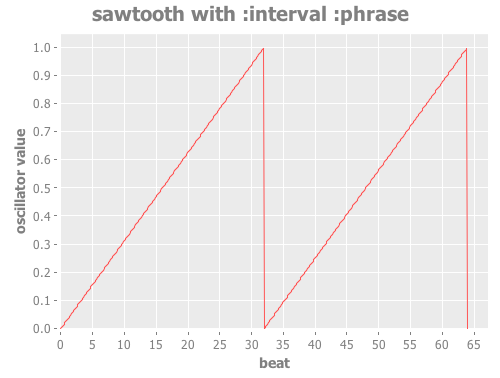
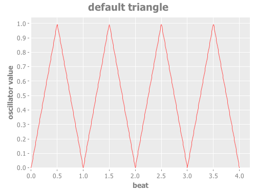
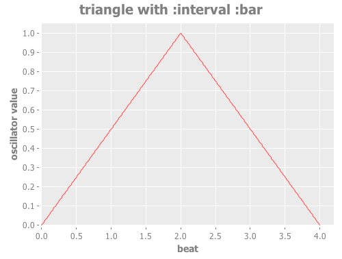
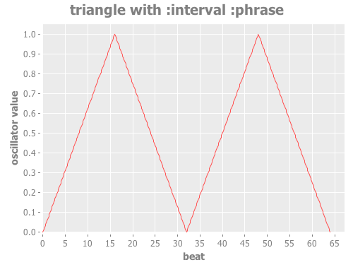
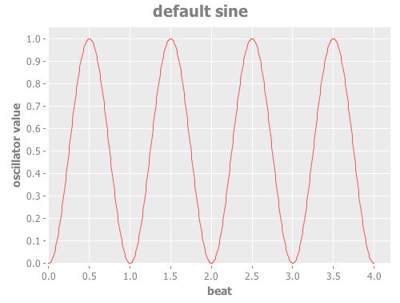
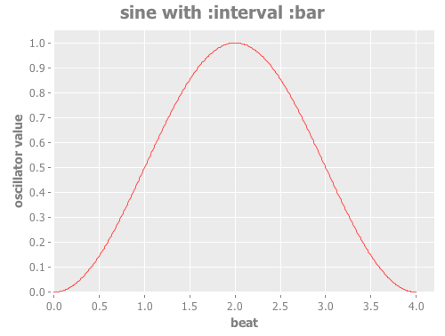
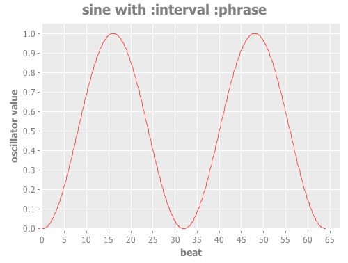
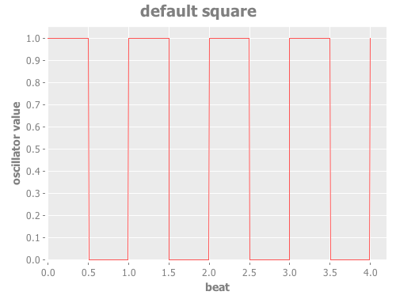
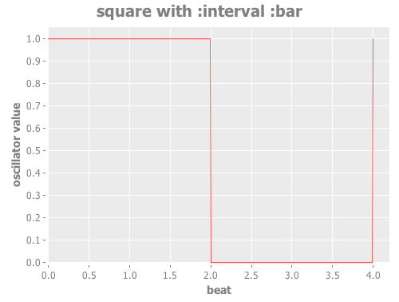
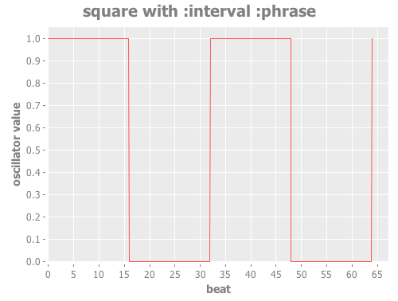

= Oscillators
James Elliott <james@deepsymmetry.org>
:icons: font
:toc:
:toc-placement: preamble

// Set up support for relative links on GitHub; add more conditions
// if you need to support other environments and extensions.
ifdef::env-github[:outfilesuffix: .adoc]

Oscillators in Afterglow are a flexible way of turning the timing
information tracked by <<metronomes#metronomes,metronomes>> into
waveforms that can be used to make lights do interesting things. They
can be related to the beats, bars, or phrases of the metronome, or
multiples or fractions thereof, and can create
<<sawtooth-oscillators,sawtooth>>,
<<triangle-oscillators,triangle>>, <<square-oscillators,square>>, or
<<sine-oscillators,sine>> waves.

Metronomes keep track of musical time relative to some starting point,
in terms of beats, bars (by default four beats to a bar), and phrases
(usually eight bars to a phrase). In addition to keeping track of the
current beat, bar, and phrase, metronomes can also tell you the _phase_
of that beat, bar, or phrase, which is a measurement of progress through
the beat, bar, or phrase. The phase starts out at 0.0 at the very
beginning of the interval, and grows towards, but never quite reaches,
1.0, because at that point you will be on to phase 0.0 of the following
interval.

So, in a sense, by itself a metronome can give you a
<<sawtooth-oscillators,sawtooth>> wave related to its intervals, just
by looking at the interval phase. The sawtooth oscillators build on that
by letting you change the direction of oscillation, so it starts at 1.0
and slides downward, the speed of oscillation, so it ramps over
multiples or fractions of an interval, and also let you shift the phase
of the wave so it does not coincide with the interval itself.

So that all of the lighting effects created for a given frame of control
output are synchronized and share the same notion of the current state
of the metronome, Afterglow takes a _snapshot_ of the metronome at the
start of the frame, and the oscillators work from that.

== Sawtooth Oscillators

[source,clojure]
----
(afterglow.effects.oscillators/sawtooth)
----

Returns an oscillator which generates a
http://en.wikipedia.org/wiki/Sawtooth_wave[sawtooth wave] relative to
the phase of the current beat. At the start of the beat, the value will
be 0.0, and at the end of the beat, the value will have grown linearly
to 1.0.

You can change the nature of the wave by using optional keyword
parameters:

[cols=",,",options="header",]
|=======================================================================
|Parameter |Default |Purpose
|`:down?` |`false` |When `true` the wave starts at 1.0 and falls
linearly to 0.0.

|`:interval` |`:beat` |Change whether the oscillator cycles over each
beat, bar, or phrase, by passing in the keyword `:beat`, `:bar`, or
`:phrase`. There are graphs showing the other intervals below.

|`:interval-ratio` |`1` |Runs the oscillator at the specified
 <<ratios,multiple or fraction>> of the interval (beat, bar, or
 phrase).

|`:phase` |0.0 |<<phase-shifting,Offsets>> the oscillator from the
interval boundary by the specified amount (where 1.0 is an entire
interval, and so would have no visible effect).
|=======================================================================

As noted in the table, the direction of the wave can be reversed:

[source,clojure]
----
(afterglow.effects.oscillators/sawtooth :down? true)
----

image:assets/sawtooth-beat-down.png[Downward
Sawtooth Oscillator]

=== Ratios

All of the oscillators can be modified by supplying the
`:interval-ratio` keyword argument. This argument specifies a fraction
that adjusts the speed of the oscillator with respect to the interval
it is oscillating over. For example a beat-oriented oscillator
normally goes through its entire wave shape once per beat. If you
supply an `:interval-ratio` of `2`, it will run half as fast, taking
two beats to go through its waveform.

image:assets/sawtooth-beat-ratio-2.png[Sawtooth
Beat Oscillator with Beat Ratio 2]

An `:interval-ratio` of `1/3` speeds it up so that it only takes
one-third of a beat to go through its oscillation, and will finish
three complete cycles each beat.

image:assets/sawtooth-beat-ratio-1-3.png[Sawtooth Oscillator with
Interval Ratio 1/3]

These can be combined, of course, so an `:interval-ratio` of `2/3`
would complete three cycles every two beats.

image:assets/sawtooth-beat-ratio-2-3.png[Sawtooth Oscillator with
Interval Ratio 2/3]

=== Phase Shifting

All of the oscillators can be modified by supplying a `:phase` keyword
argument, which offsets them from the actual phase of the interval that
they are tracking. For example, if you supply a `:phase` value of `0.5`,
the oscillator will be pushed exactly halfway out-of-phase with the
metronome interval, so that it will act as if a beat is starting halfway
through the actual beat. A positive value shifts the oscillator ahead of
the underlying interval, and a negative value delays it. Only values
between -1.0 and 1.0 make sense, since shifting multiple intervals has
no functional difference from staying within the current interval. In
other words, passing in exactly 1.0 (or 2.0, etc.) is the same as
passing in 0.0, and will have no effect on the oscillator.

image:assets/sawtooth-beat-phase.png[Sawtooth
Oscillator with Phase 0.25]

As noted in the table above, to have the oscillator work with
intervals other than beats, you use the optional keyword argument
`:interval`. For example to have the sawtooth spread over each bar:

[source,clojure]
----
(afterglow.effects.oscillators/sawtooth :interval :bar)
----

image:assets/sawtooth-bar.png[Sawtooth Bar Oscillator]

And to have it oscillate over each phrase:

[source,clojure]
----
(afterglow.effects.oscillators/sawtooth :interval :phrase)
----

== Triangle Oscillators

[source,clojure]
----
(afterglow.effects.oscillators/triangle)
----

Returns an oscillator which generates a
http://en.wikipedia.org/wiki/Triangle_wave[triangle wave] relative to
the phase of the current beat. At the start of the beat, the value will
be 0.0, at the midpoint, the value will have grown linearly to 1.0, and
at the end of the beat it will have returned to 0.0.

You can change the nature of the wave by using optional keyword
parameters:

[cols=",,",options="header",]
|=======================================================================
|Parameter |Default |Purpose
|`:interval` |`:beat` |Change whether the oscillator cycles over each
beat, bar, or phrase, by passing in the keyword `:beat`, `:bar`, or
`:phrase`. There are graphs showing the other intervals below.

|`:interval-ratio` |`1` |Runs the oscillator at the specified
 <<ratios,multiple or fraction>> of the interval (beat, bar, or
 phrase).

|`:phase` |0.0 |<<phase-shifting,Offsets>> the oscillator from the
beat by the specified amount
|=======================================================================

NOTE: The effects of the `:interval-ratio` and `:phase` parameters are
discussed in more depth, and illustrated with graphs, in the
documentation for the Sawtooth oscillator. You can jump to those
sections using the links in the _Purpose_ section of the table.

As noted in the table above, to have the oscillator work with
intervals other than beats, you use the optional keyword argument
`:interval`. For example to have the triangle spread over each bar:

[source,clojure]
----
(afterglow.effects.oscillators/triangle :interval :bar)
----

And to have it oscillate over each phrase:

[source,clojure]
----
(afterglow.effects.oscillators/triangle :interval :phrase)
----

== Sine Oscillators

Just like in musical synthesis, sine waves are the smoothest-feeling
waves of all, and are good for creating gentle, subtle effects which
ease in and out.

[source,clojure]
----
(afterglow.effects.oscillators/sine)
----

Returns an oscillator which generates a
http://en.wikipedia.org/wiki/Sine_wave[sine wave] relative to the phase
of the current beat. At the start of the beat, the value will be 0.0 and
beginning to rise slowly, picking up speed as it goes, and slowing down
again as it approaches the midpoint. At the midpoint, the value will
reach 1.0 and begin falling slowly, again picking up speed, and at the
end of the beat it will have returned to 0.0.

You can change the nature of the wave by using optional keyword
parameters:

[cols=",,",options="header",]
|=======================================================================
|Parameter |Default |Purpose
|`:interval` |`:beat` |Change whether the oscillator cycles over each
beat, bar, or phrase, by passing in the keyword `:beat`, `:bar`, or
`:phrase`. There are graphs showing the other intervals below.

|`:interval-ratio` |`1` |Runs the oscillator at the specified
 <<ratios,multiple or fraction>> of the interval (beat, bar, or
 phrase).

|`:phase` |0.0 |<<phase-shifting,Offsets>> the oscillator from the
beat by the specified amount
|=======================================================================

NOTE: The effects of the `:interval-ratio` and `:phase` parameters are
discussed in more depth, and illustrated with graphs, in the
documentation for the Sawtooth oscillator. You can jump to those
sections using the links in the _Purpose_ section of the table.

As noted in the table above, to have the oscillator work with
intervals other than beats, you use the optional keyword argument
`:interval`. For example to have the sine wave spread over each bar:

[source,clojure]
----
(afterglow.effects.oscillators/sine :interval :bar)
----

And to have it oscillate over each phrase:

[source,clojure]
----
(afterglow.effects.oscillators/sine :interval :phrase)
----

== Square Oscillators

Square waves are good for abrupt transitions, like strobes, or switching
between different effects.

[source,clojure]
----
(afterglow.effects.oscillators/square)
----

Returns an oscillator which generates a
http://en.wikipedia.org/wiki/Square_wave[square wave] relative to the
phase of the current beat. At the start of the beat, the value will be
1.0. At the midpoint, it will instantly drop to 0.0, where it will stay
until the end of the beat.

You can change the nature of the wave by using optional keyword
parameters:

[cols=",,",options="header",]
|=======================================================================
|Parameter |Default |Purpose
|`:width` |`0.5` |Determines the phase at which the value changes from
1.0 to 0.0, and therefore the width of the 1.0 pulse

|`:interval` |`:beat` |Change whether the oscillator cycles over each
beat, bar, or phrase, by passing in the keyword `:beat`, `:bar`, or
`:phrase`. There are graphs showing the other intervals below.

|`:interval-ratio` |`1` |Runs the oscillator at the specified
 <<ratios,multiple or fraction>> of the interval (beat, bar, or
 phrase).

|`:phase` |0.0 |<<phase-shifting,Offsets>> the oscillator from the
beat by the specified amount
|=======================================================================

NOTE: The effects of the `:interval-ratio` and `:phase` parameters are
discussed in more depth, and illustrated with graphs, in the
documentation for the Sawtooth oscillator. You can jump to those
sections using the links in the _Purpose_ section of the table.

=== Pulse Widths

As shown in the above graph, the square oscillator normally spends
half its time in the &ldquo;on&rdquo; state (at the value one), and
half its time &ldquo;off&rdquo; (at zero). You can adjust that by
passing a value between `0.0` and `1.0` with the optional keyword
argument `:width`. This tells the oscillator what fraction of the time
to be on. For example, with the value `0.8`, it is on 4/5 of the time:

[source,clojure]
----
(afterglow.effects.oscillators/square :width 0.8)
----

Alternately, using a `:width` of `0.1` causes the oscillator to be on
for only one tenth of each beat:

[source,clojure]
----
(afterglow.effects.oscillators/square :width 0.1)
----

You can shift where within the beat the transitions take place using
the `:phase` argument, as with all oscillators, in the manner
described <<phase-shifting,above>>.

NOTE: The `:width` value must be greater than `0` and less than `1`,
or the oscillator would not oscillate at all.

As noted in the table above, to have the oscillator work with
intervals other than beats, you use the optional keyword argument
`:interval`. For example to have the wave spread over each bar:

[source,clojure]
----
(afterglow.effects.oscillators/square :interval :bar)
----

And to have it oscillate over each phrase:

[source,clojure]
----
(afterglow.effects.oscillators/square :interval :phrase)
----

==== License

++++++
Copyright © 2015 http://deepsymmetry.org[Deep Symmetry, LLC]

Distributed under the
http://opensource.org/licenses/eclipse-1.0.php[Eclipse Public License
1.0], the same as Clojure. By using this software in any fashion, you
are agreeing to be bound by the terms of this license. You must not
remove this notice, or any other, from this software. A copy of the
license can be found in
https://cdn.rawgit.com/brunchboy/afterglow/master/resources/public/epl-v10.html[resources/public/epl-v10.html]
within this project.
