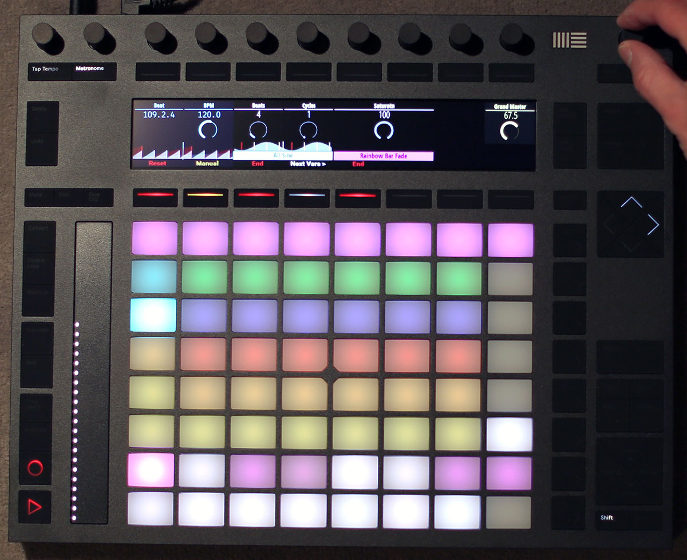
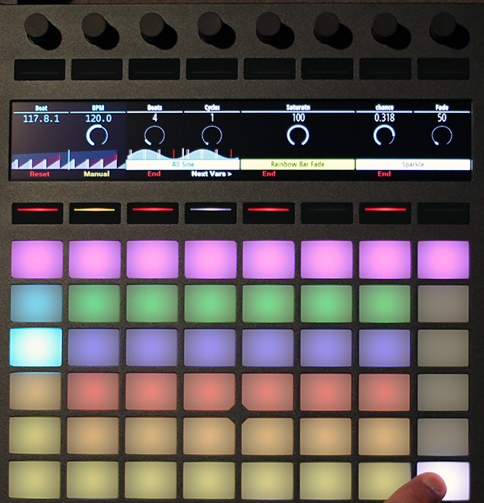
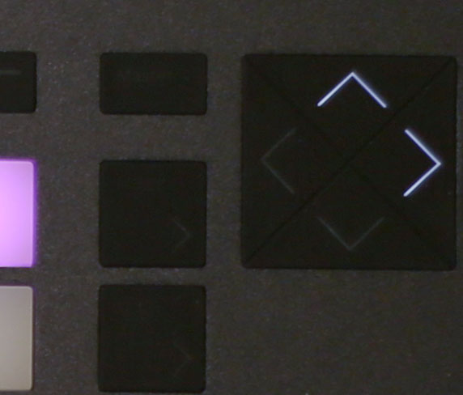
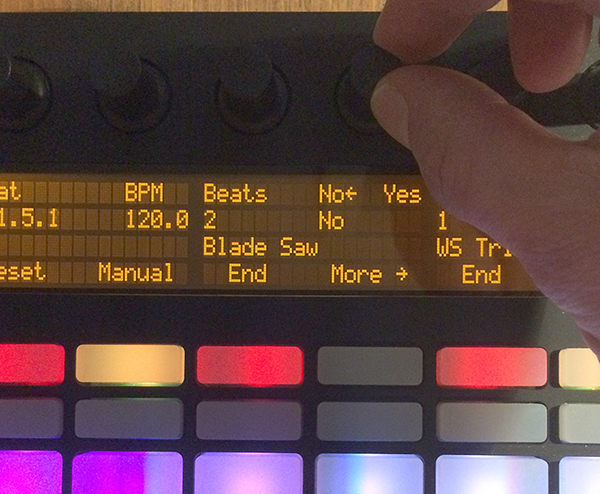
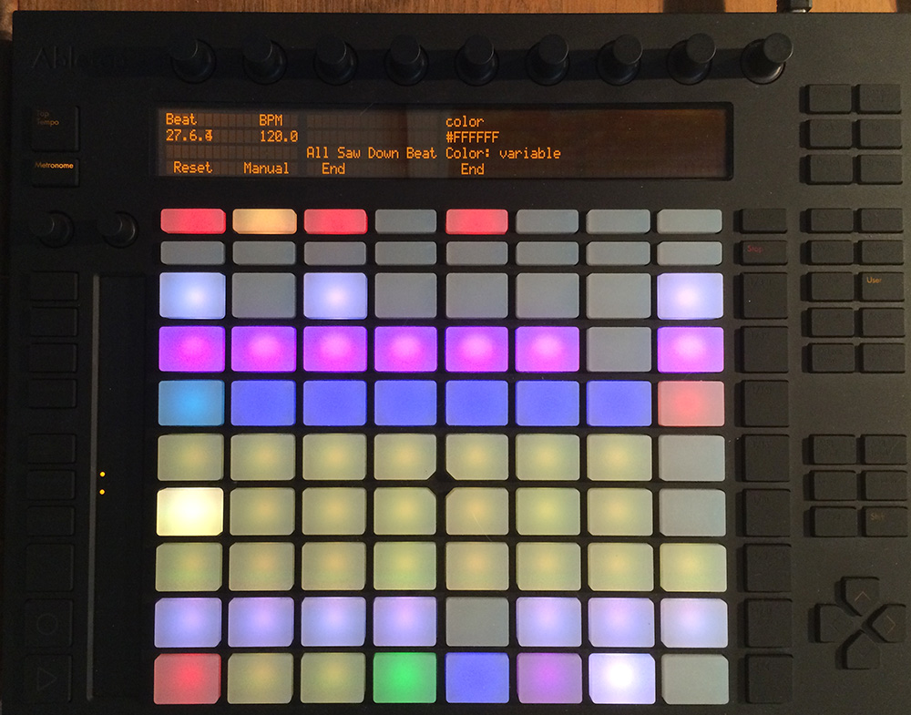
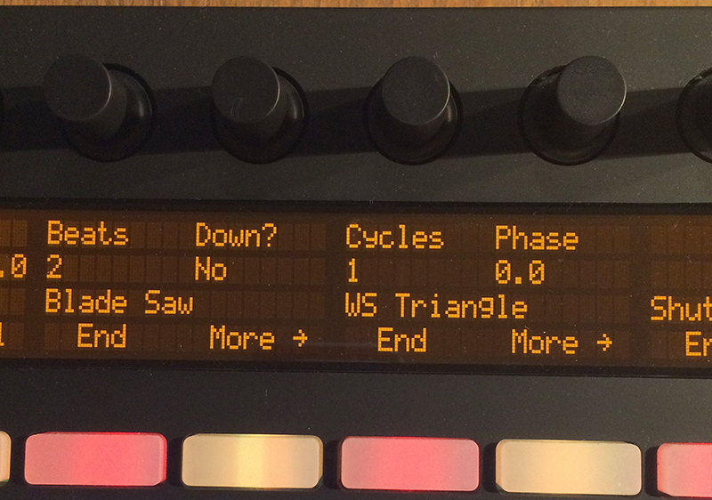
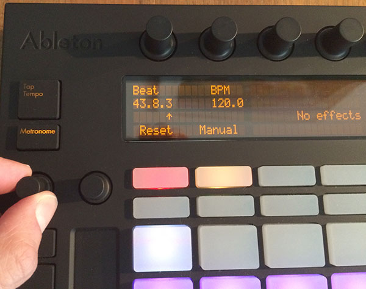
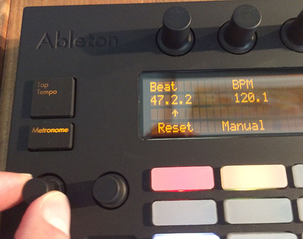

= Using Ableton Push 2
James Elliott <james@deepsymmetry.org>
:icons: font
:experimental:
:toc:
:toc-placement: preamble
:api-doc: http://rawgit.com/brunchboy/afterglow/master/api-doc/

// Set up support for relative links on GitHub; add more conditions
// if you need to support other environments and extensions.
ifdef::env-github[:outfilesuffix: .adoc]

Some controllers have such rich capabilities that they deserve their
own custom mapping implementations to exploit their capabilities as a
show control interface. The Push 2 called out for such treatment, and
thankfully in March 2016 Ableton published documentation which made
that possible, and a
{api-doc}afterglow.controllers.ableton-push-2.html[mapping] has been
created. You can use it to do most of the things that you would use
the <<README#the-embedded-web-interface,web interface>> for, often
with deeper control, since you can press multiple cue trigger pads at
the same time, and they respond to variations in pressure.

NOTE: This document is in progress; the photos currently show the
original Push. They will shortly be replaced with photos of the Push 2
in action. There is also a page describing the
<<push#using-ableton-push,original Push mapping>>.

## Binding to the Push 2

Assuming you have an Ableton Push 2 connected to the machine running
Afterglow, you can activate the Push 2 mapping and attach it to the
current default show like this, as long as its User Port shows up in
your MIDI environment with the standard name `"User Port"`:

[source,clojure]
----
(require '[afterglow.controllers :as ct])
(def watcher (ct/auto-bind *show* "User Port"))
----

You will see a brief startup animation, and Afterglow's Push 2
interface will start. (This also arranges for the Push to be re-bound
to the show if it gets disconnected or powered off and then reappears,
which is very handy in a performance setting.) Here is an overview of
how the Push 2 mapping works, with details explained in the upcoming
sections:

image::assets/Push2NoEffects.jpg[Push 2 interface]

== Show Control

Once you have the Push 2 bound to a show, it becomes a very direct and
tactile way to monitor and control the cues and other aspects of the
show.

The graphical display at the top of the Push displays the effects
currently running, and can optionally display
<<metronome-control,metronome>> information as well. If a cue was
defined with adjustable variables for its effect, they will also be
displayed, and you will be able to <<effect-control,adjust>> them by
turning the encoder above the variable.

The rightmost encoder, past the display, adjusts the show Grand
Master, which controls the maximum brightness that any dimmer cue can
achieve, so you can always use it to adjust the overall brightness of
the show. As soon as you touch the encoder, the Grand Master level
will appear along with a gauge representing what fraction of its
maximum level is currently in effect, and both will be updated as you
turn the encoder. When you release it, the display returns to showing
whatever it was before.

As with other numeric values that you can adjust, while you are
adjusting the Grand Master, the touch strip on the left hand side of
the Push will light up in the same proportion as the circular gauge
in the display under the encoder, and you can touch or drag on the
strip to instantly set the level to whatever value you want.

The red kbd:[&#9655;] button to the at the bottom left of the cue grid
can be used to temporarily shut down the show, blacking out all
universes that it controls, and suspending the processing of its
effects.

image::assets/ShowStop2.jpg[Show stopped]

Whenever the show is stopped, the button becomes a green Play button.
Pressing it again restarts the show where it would have been had it
not stopped.

== Cues

Most of the space on the interface is dedicated to an 8&times;8 grid
of color coded cue trigger pads, which provide a window onto the
show's overall <<cues#cues,cue grid>>. The Push 2 can be
<<README#scrolling-and-linked-controllers,linked>> to the
<<README#the-embedded-web-interface,web interface>> so that both
always display the same section of the cue grid, and the web interface
can remind you of the names of the cues you are looking at, or it can
be scrolled independently, allowing you access to more cues at the
same time.

TIP: If you have more than one compatible grid controller, you can
have Afterglow using all of them at the same time; each can be
scrolled to different areas of the cue grid, and each can even be
linked to a different browser window if you have that much screen
space.

You can activate any cue shown by pressing its pad; running cues will
light up, and darken again when they end. The effects which cues
create will also appear in the display above the cue pad, from left to
right, with the most recent effect on the right. In the photo below,
&ldquo;Sparkle&rdquo; is the most recent effect, and it has two
variables, `chance` and `Fade`, which can be adjusted by turning the
encoders above them. The `chance` value is changing because it is
configured to also be adjusted through the pressure sensitive cue pad
that was used to launch it.

To stop a running cue, press its pad again, or press the red kbd:[End]
pad underneath its effect entry in the display. Some cues will end
immediately, others will continue to run until they reach what they
feel is an appropriate stopping point. While they are in the process
of ending, the cue pad will blink, and the kbd:[End] pad will be
labeled kbd:[Ending]. If you want the cue to end immediately even
though it would otherwise run for a while longer, you can press the
blinking cue pad (or effect kbd:[Ending] pad) again and it will be
killed right then.

The colors assigned to cue pads by the creator of the cue grid are
intended to help identify related cues. Some cues (especially intense
ones like strobes) are configured to run only as long as they are held
down. In that case, when you press cue pad, it lights up with a
whitened version of the cue color as a hint that this is happening,
and as soon as you release the pad, the cue will end. If you want to
override this behavior, you can hold down the kbd:[Shift] button
(towards the bottom right of the Push) as you press the cue pad, and
it will activate as a normal cue, staying on until you press it a
second time.

As noted above, cues can also be configured to take advantage of the
pressure sensitivity of the Push cue pads, so that as you vary the
pressure with which you are holding down the pad, some visible
variable of the cue is altered. The strobe and sparkle cues in
created by
{api-doc}afterglow.examples.html#var-make-cues[`afterglow.examples/make-cues`]
for the sample show work this way: the intensity and lightness of the
strobe are increased by pressure, and so is the chance that a sparkle
will be assigned to a light on each frame. You can see these
variables change in the display above the cue's effect name while
you are adjusting them, as shown in the photo above.

[[exclusivity]]Cues may be mutually exclusive by nature, and if they
were created to reflect this (by using the same keyword to register
their effects with the show, or specifying other effect keys in their
`:end-keys` list), when you activate one, the other cues which use the
same keyword are dimmed. This is a hint that when you activate one of
them, it will _replace_ the others, rather than running at the same
time. In the photo <<gobo-photo,below>>, the rest of the
Torrent 1 fixed gobo cues (the leftmost blue cues) are dimmed because
they would replace the running &ldquo;T1 atom shake&rdquo; cue.

== Scrolling

The show will likely have many more cues than fit on the pad grid; the
diamond of arrow buttons to the right of the top of the cue grid allow
you to page through the larger show grid. If there are more cues
available in a given direction, that arrow will be lit, otherwise it
is dark. Pressing an active arrow scrolls the view one
&ldquo;page&rdquo; in that direction. In the photo below, it is
currently possible to scroll up and to the right:

If you hold down the kbd:[Shift] button, the arrows will scroll you as
far as possible in the direction that you press.

The kbd:[Page <] and kbd:[Page >] buttons allow you to scroll the text
display left and right, to see and <<effect-control,adjust>> all of
the currently running effects, even though only four at a time (or
three, if the <<metronome-control,metronome section>> is showing) fit
in the display. Pressing the kbd:[Page <] scrolls the display left,
showing you older (or lower priority) effects, and kbd:[Page >]
scrolls the next group effects to the right into view, showing you
newer and higher priority effects. Pressing these buttons while
kbd:[Shift] is held will scroll as far as possible in the
corresponding direction.

== Effect Control

As described above, the effects created by cues appear in the text
display area, and can be scrolled through and ended by pressing the
corresponding red kbd:[End] pad which appears underneath them.

=== Numeric Cue Variables

If the cue that created an effect has numeric variables assigned to
it, the variable names and values will appear above the effect name,
and they can be adjusted using the encoder knob above the variable.
For example, in addition to varying the sparkle `chance` variable
using the pad pressure, as was done above, its `Fade` variable can be
adjusted using the effect variable encoder above it. As soon as you
touch the encode knob associated with a variable, a graphical
representation of the current value replaces its name, and updates as
you turn the encoder to change the value.

image::assets/AdjustingFade.jpg[Adjusting Fade variable]

While you are adjusting the variable, the large touch strip on the
left hand side of the Push lights up to show you where you are in the
variable range, and you can touch and drag on the strip to instantly
set the variable to another value. Most numeric variables will have
values that grow from the bottom of the touch strip, but variables
marked as `:centered`, like Pan and Tilt, grow from the center up or
down.

If an effect has only one adjustable variable, it will take up the
entire effect area, and you can use either encoder to adjust it, as
when adjusting a Focus <<cues#creating-function-cues,function cue>>
for the Torrent moving head spot:

image::assets/AdjustingFocus.jpg[Adjusting Focus cue]

When you release the encoder knob, the adjustment graph disappears,
and the variable name reappears.

The <- indicator at the left of the text area in the above photo is an
indicator that there are older effects which have been scrolled to the
left, off the display. You will see -> at the bottom right of the
display when there are newer effects to the right. You can scroll to
them using the kbd:[Shift] button with the scroll arrow buttons as
described <<scrolling,above>>.

This photo also illustrates the dimming of incompatible cues discussed
<<exclusivity,above>>: The leftmost columns of blue cues
all establish settings for the fixed gobo wheel of one of the Torrent
moving-head spots. Since one of them is active (the `T1 atom
shake` effect at the left of the text area corresponds to the
bright blue button three rows down the second column), the others are
dimmed to hint that pressing them would replace the active cue.

This dimming can also be seen in the web interface view of the cue grid:

[[gobo-photo]]
image::assets/GoboCues.png[Gobo cues]

=== Boolean Cue Variables

If a cue has Boolean variables assigned to it, they will also appear
above the effect name, with the current value showing as `Yes` or
`No`. To adjust them you also start by grabbing the closest encoder,
at which point you will see the two options with an arrow pointing at
the currently-chosen one. Rotate the encoder towards the option you
want to choose and the variable will be updated:

When you release the encoder knob, the choices disappear and the
variable name reappears.

You can also use the touch strip when setting a Boolean variable;
touching the top half sets it to `Yes`, while the bottom half sets it to
`No`.

=== Color Cue Variables

If a cue has color variables assigned to it, they will also appear
above the effect name. The currently assigned color value will be
displayed as a six digit hexadecimal number, representing the eight
bit red, green, and blue representation of the color value, #rrggbb.
In this photo, a cue with a color variable that starts out white has
just been launched:

When an effect is displaying a color cue variable, touching the
associated encoder will open up a special color selection interface,
which takes over the entire cue grid, as well as the effect cell:

image::assets/ColorPalette.jpg[Color adjustment palette]

In addition to adjusting the color's hue and saturation using the
encoders above the effect, you can instantly jump to a color by
tapping any of the pads in the grid, which form a palette of four
saturation levels of hues spread across the rainbow. The four pads on
the bottom right let you select white, medium gray, and black as color
values as well, and the last pad displays a preview of the currently
selected color, rather than doing anything when you press it.

If any pad other than the preview pad matches the currently selected
color, it blinks (regardless of whether you chose that color by
pressing the pad or by turning the encoders).

While you are holding the hue or saturation encoder, you can also use
the touch strip to see and jump to any value in that encoder's range.
If both encoders are being held, the touch pad allows you to select
saturations, since the touch pads already give you an easy interface
for selecting hues.

As soon as you let go of both the hue and saturation encoders, the
palette disappears and the normal cue grid returns.

=== Scrolling Through Cue Variables

If a cue has more than two variables, even though you can only see two
at a time on the Push, you can still check and adjust all of them.
Whenever there are too many to fit, the rightmost pad just below the
effect display will be lit white and labeled kbd:[Next Vars >] as shown below:

Each time you press the kbd:[Next Vars >] button, you will see the
next two variables assigned to the cue. Once you reach the end of the
list, it wraps back to the beginning. Grabbing an encoder above the
variables will adjust whichever variable is currently displayed
beneath it. (While you are holding encoders to adjust an effect's
variables, its kbd:[Next Vars >] button will be blacked out and
disabled.)

== Metronome Control

The top left section of the Push lets you view and adjust the
Metronome that the show is using to keep time with the music that is
being played. Since Afterglow's effects are generally defined with
respect to the metronome, it is important to keep it synchronized with
the music. When active, the metronome section takes over the leftmost
quarter of the text area (so there are room to see only three effects,
rather than the normal four). To toggle the metronome section, press
the kbd:[Metronome] button. It will appear if it was not showing, and
disappear if it was there. The kbd:[Metronome] button is lit more
brightly when the section is active.

The metronome section shows the current speed, in Beats Per Minute, of
the metronome, and the kbd:[Tap Tempo] button label flashes at each beat
(this flashing happens regardless of whether the metronome section is
visible in the text area). The metronome section also shows you the
current phrase number, the bar within that phrase, and the beat within
that bar which has been reached.

image:assets/PushMetronome.jpg[Metronome section]

The most basic way of synchronizing the metronome is to tap the
kbd:[Tap Tempo] button at each beat of the music. Tapping the button
aligns the metronome to a beat, and if you tap it three or more times
within two seconds of each preceding tap, sets the metronome's BPM.
Tap it as you hear each beat of the music, and after three or more
taps, the speed of the metronome will be approximately synchronized
with the music.

Once the tempo is correct, you can tell Afterglow which beat is the
down beat by holding down the kbd:[Shift] button while pressing
kbd:[Tap Tempo]. This combination does not change the tempo, but tells
Afterglow that the moment when you tapped the button is the down beat
(the first beat of a bar).

You can also adjust the BPM by turning the BPM encoder, which is the
rightmost encoder below the Metronome button:

image:assets/PushBPM.jpg[BPM encoder]

While you are holding this encoder, the symbol `&uparrow;` appears below
the BPM value as a visual reminder of what value you are adjusting.
Turning the encoder clockwise raises the BPM, turning counterclockwise
lowers it. While the metronome section is showing, you can also use
the encoder above the BPM value to adjust it. But you can grab the
dedicated BPM encoder below the kbd:[Metronome] button even when the
metronome section is not showing, and it will appear while you have
the encoder in your hand, so you can adjust the BPM quickly, and then
get back to what you were doing.

If you press the kbd:[Shift] button, the BPM encoder can be used to
adjust the BPM by whole beats rather than tenths. While kbd:[Shift] is
down, the `&uparrow;` will point to the left of the decimal point
rather than to the right of it, and the BPM will change ten times as
quickly as you turn it. You can switch back and forth in the middle of
your adjustments by pressing and releasing the shift key at any time.

In order to make longer chases and effects line up properly with the
music, you will also want to make sure the count is right, that the
beat number shows `1` on the down beat, and that the bar numbers are
right as well, so that the start of a phrase is reflected as bar
number `1`. In addition to using kbd:[Shift] with kbd:[Tap Tempo] to
set the down beat, you can adjust the current beat number using the
beat encoder, the leftmost encoder below the metronome button:

While you are holding this encoder, the symbol `&uparrow;` appears
below the beat number as a visual reminder of what value you are
adjusting. Turning the encoder clockwise jumps to the next beat,
turning counterclockwise jumps back to the previous one. As a tactile
reminder that you are adjusting whole beats, this encoder moves with a
distinct click as it changes value, while the BPM encoder turns
smoothly as you scroll through fractional BPM values.

While the metronome section is showing, you can also use the encoder
above the Beat value to adjust it. But you can grab the dedicated Beat
encoder below the kbd:[Metronome] button even when the metronome
section is not showing, and it will appear while you have the encoder
in your hand, so you can adjust the beat number quickly, and then get
back to what you were doing.

If you press the kbd:[Shift] button, the Beat encoder can be used to
adjust the current bar within the phrase instead of the current beat.
While kbd:[Shift] is down, the `&uparrow;` will point at the bar
instead of the beat, and turning the encoder will jump that value
forwards or backwards:

If you know a phrase is about to begin, you can press the red Reset
pad in the metronome section right as it does. This will reset the
count to Phrase 1, Bar 1, Beat 1.

Trying to keep up with tempo changes during dynamic shows can be
tedious, so you will hopefully be able to take advantage of
Afterglow's metronome synchronization features. If the DJ can send you
<<mapping_sync#syncing-to-midi-clock,MIDI clock pulses>>, or you can
connect via a Local Area Network to Pioneer professional DJ gear to
lock into the beat grid established by
<<mapping_sync#syncing-to-pro-dj-link,Pro DJ Link>>, Afterglow can
keep the BPM (with MIDI) and even the beats (with Pro DJ Link and the
Traktor Afterglow Beat Phase
<<mapping_sync#syncing-to-traktor-beat-phase,controller mapping>>)
synchronized for you. The Sync pad in the Metronome section (showing
`Manual` sync in these photos) will eventually allow you to set this
up, but that is not yet implemented, so for now you will need to use
the <<README#metronome-control,web interface>> to configure it.

NOTE: The pad does already change color to let you know the sync
status: amber means manual, green means successful automatic sync, and
red means a requested automatic sync has failed. It is likely that a
future release of Afterglow will let you press this pad to choose your
sync source.

Once your sync is established, the meaning of the kbd:[Tap Tempo]
button changes. If you are using MIDI clock to sync the BPM, it
becomes a kbd:[Tap Beat] button, which simply establishes where the
beat falls. If you are locked in to a Pro DJ Link beat grid or using
the Traktor beat phase mapping, the beats are automatically aligned
for you so, it becomes a kbd:[Tap Bar] button which, when pressed,
indicates that the current beat is the down beat (start) of a bar.
(Similarly, if you press the metronome kbd:[Reset] pad while synced to
a Pro DJ Link beat grid or Traktor beat phase, the beat itself will
not move, but the beat closest to when you pressed the pad will be
identified as Beat 1.) In these sync modes you can also use the
kbd:[Shift] button to align at the next bigger boundary: If tapping
would normally move the bar, shift-tapping will move the phrase.

If you try to adjust the BPM encoder while sync is active, it will
have no effect, and Afterglow will point at the sync mode to explain
why it is ignoring your adjustments.

=== Sharing the Push 2

If you are using Afterglow at the same time as Ableton Live, you can
switch back and forth between which has control of the Push by
pressing the kbd:[User] button. If Live is not running when you press
kbd:[User], the Push interface will simply go blank (except for the
kbd:[User] button itself), until you press it again, at which point
Afterglow will light it up.

NOTE: Future releases will take advantage of more of the buttons on
the controller.

==== License

++++++
Copyright © 2015-2016 http://deepsymmetry.org[Deep Symmetry, LLC]

Distributed under the
http://opensource.org/licenses/eclipse-1.0.php[Eclipse Public License
1.0], the same as Clojure. By using this software in any fashion, you
are agreeing to be bound by the terms of this license. You must not
remove this notice, or any other, from this software. A copy of the
license can be found in
https://rawgit.com/brunchboy/afterglow/master/resources/public/epl-v10.html[resources/public/epl-v10.html]
within this project.
